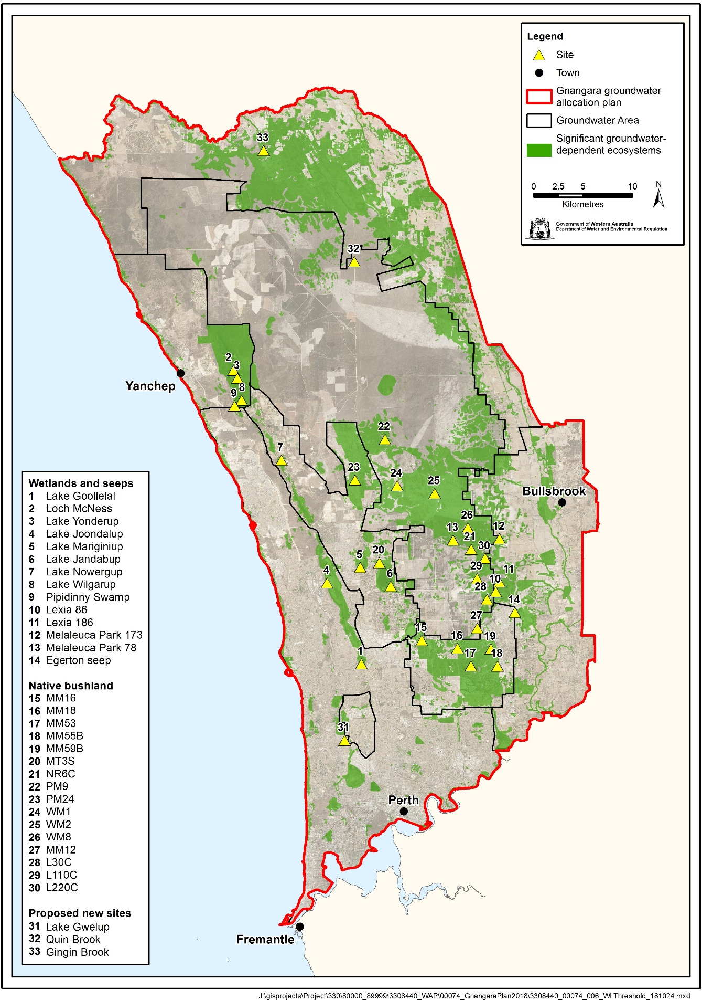

```{r setup, include=FALSE}
library(knitr)
library(kableExtra)
library(flextable)
library(ggplot2)
library(zoo)
library(ggpubr)
library(bookdown)
library(dplyr)
library(ggrepel)
source("functions.R")
knitr::opts_chunk$set(fig.path='Figs/',
                      echo=FALSE, warning=FALSE, message=FALSE)
```

\newpage

# Executive Summary

[SUMMARY TABLE OF OUTCOMES]

\newpage
\tableofcontents
\newpage

# Introduction

This report details an analysis that reviews the ecological impacts of revised proposed water level thresholds for wetlands in the Gnangara mound.

Full analysis can be found at (https://github.com/ChrisKav/DWER-Thresholds-2019)

[OUTLINE OF REPORT STRUCTURE]

[TABLE OF WETLANDS <- THE DUNE COMPLEX THEY BELONG TO, WHETHER VEG/INVERT MONITORING, COORDINATES ]

```{r, echo=FALSE}
load("Refined_data.RData")
```

\newpage

## Study area

The Gnangara Groundwater System is located on the Swan Coastal Plain in south-western Australia. The system covers an area of 220 000 ha, extending from the Swan River in the south to the Moore River and Gingin Brook in the north and from the Darling Scarp in the east to the Indian Ocean in the west (Figure \ref{fig:Map}). The system consists of three major aquifers: the Superficial aquifer, Leedervilee aquifer and the Yarragadee aquifer. The Gnangara Mound is an expression of the Superficial aquifer, an unconfined aquifer composed of Quaternary-Tertiary sediments of the Swan Coastal Plan that is in direct connection with the lower Leederville aquifer at locations where the Osborne Formation has eroded [@Salama1991]. The underlying confined Leederville aquifer supplies Perth with up to 60 % of its drinking water supply. The Superficial aquifer consists mainly of sand, silt and clay sediments up to 100 m thick with different soils types distributed parrallel to the coastline. These soils consist of Guilford Clay in the east, the Bassendean Dune System and Spearwood Dune Systems in the middle and the Quindalup Dune System along the west coast [@McArthur1960], with the distribution of vegetation and aquatic invertebrates largely determined by the underlying soil type, landform and depth to ground water [@Heddle1980].

Recharge of the Gnangara Mound has been declining due to disruptions of water balances. Major users of ground water in the Gnangara Mound include native vegetation, pine forest plantations, market gardens and wetlands [@Salama1991]. Clearing of native vegetation for pine plantations potentially reduces the recharge of ground water as pines transpire more than the native plants they replace as well as they directly access deeper levels of the water table. Agriculture abstraction of ground water is also causing declines in water levels. Ground water recharge has also been hampered by declining rainfall for the south west region of Australia. It is estimated rainfall has been declining by approximately 12 mm/year since the 1970's [@England2006]. Since the mid 1990's rainfall has generally been below the longterm average (Figure \ref{fig:RainfallPlot}). The combined effects of ground water abstraction, changes in vegetation and declining annual rainfall have contributed to longterm declines in ground water of the Gnangara Mound [@Yesertener2008].

The region experiences a Mediterranean-type climate with hot  dry summers and cooller wet winters. June to August represent the wettest months of the year and December to March usually have little rainfall (Figure \ref{fig:RainfallMonthPlot}). Although declining rainfall has contributed to decreasing ground water levels in the Gnangara Mound, abstraction of ground water from private wells, market gardens, pine plantations and drinking water have cummulatively driven the decline. Nonetheless, up to 20 % less rainfall and 64 % less runoff occured in the region between 1997 and 2003 compared to 1911 and 1974 [@Yesertener2008]. Drawdown of ground water effects the mortality and health of plant communities that depend on ground water access [@Groom2000] and the composition of aquatic invertebrate communities that inhabit the surface waters of wetlands that frequent the Gnangara Mound [@Horwitz2008; @Horwitz2009].

```{r Map, fig.cap="\\label{fig:Map}Location of Gnangara Mound and wetland and terrestrial sites investigated in this report.", results = 'asis'}

```

```{r RainfallPlot, fig.cap="\\label{fig:RainfallPlot}Annual rainfall data reported for Perth Airport (BOM Site 9021) for 1950 - 2018. Dotted line represent average annual rainfall for the entire period. Solid line represents a 5-year moving average of annual rainfall data.", results = 'asis'}
load("rainfall_trends.RData")
rain.plot
```

```{r RainfallMonthPlot, fig.cap="\\label{fig:RainfallMonthPlot}Monthly rainfall data reported for Perth Airport (BOM Site 9021) for 1950 - 2018.", results = 'asis'}
load("rainfall_trends.RData")
rain.month
```

# Methods

## Vegetation monitoring

## Aquatic invertebrate monitoring

## Statistical analyses

## Managerial obligation assessment

\newpage

# General observations

## Wetland vegetation

Vegetation transects have been monitored at wetlands since 1996 to 2018, although not all wetlands have been monitored every year (Figure \ref{fig:SurveyPeriod}). 

```{r SurveyPeriod, fig.cap="\\label{fig:SurveyPeriod} Period of survey for each wetland.", results = 'asis'}
wetlands <- data.frame(read.csv("wetlands.csv", header=FALSE)[,1])
First <- c(1999, 1997, 2013, 1996, 1996, 1996, 1997, 2004, 1996, 1996, 1996, 0, 2009, 1997, 1997, 1999, 0, 0, 0, 0, 0, 0)
Last <- c(2018, 2014, 2017, 2018, 2015, 2015, 2018, 2018, 2018, 2016, 2018,  0, 2018, 2012, 2018, 2018, 0, 0, 0, 0, 0, 0)
survey.yrs <- cbind(wetlands, First, Last)
colnames(survey.yrs)[1] <- "wetland"
survey.yrs$First[survey.yrs$First==0] <- NA 
survey.yrs <- na.omit(survey.yrs)
rownames(survey.yrs) <- survey.yrs$wetland

ggplot(survey.yrs, aes(Last, wetland)) +
  theme_bw() +
  geom_segment(aes(x = survey.yrs$First, y = wetland, xend = Last, yend = wetland), color = "grey50") +
  geom_point(aes(survey.yrs$First, survey.yrs$wetland)) +
  geom_point(aes(survey.yrs$Last, survey.yrs$wetland)) +
  labs(x = "Year", y = "Wetland") +
  theme(axis.line = element_line(colour = "black"),
        panel.grid.major = element_blank(),
        panel.grid.minor = element_blank(),
        panel.border = element_blank(),
        panel.background = element_blank()) +
  scale_y_discrete(limits=rev(c("Goollelal", "Loch_McNess", "Yonderup", "Joondalup_Nth", "Joondalup_Sth", 
                                "Mariginiup", "Jandabup", "Nowergup_Nth", "Nowergup_Sth", "Wilgarup", "Lexia_186", 
                                "EMP_173", "EMP_78", "Gwelup", "Quin_Brook")))
  
```

## Aquatic invertebrate communities

The aquatic invertebrate assemblages form three distinct groups based on the dunal system of the wetland (Figure \ref{fig:InvertOrd}). The Spearwood Dunes (Lake Goollelal, Lake Jonndalup, Loch McNess, Lake Nowergup and Lake Yonderup) form the most diverse group, while the Bassendean Dunes Wetlands (Melaleuca Park 173) and East Wanneroo Interdunal Wetlands (Lake Jandabup and Lake Mariginiup) have different assemblages to each other. Generally, the Bassendean Dunes and East Wanneroo Interdunal Dunes wetlands are becoming more similar with each other, although such conclusions are based on a very limited set of wetlands. The Spearwood Dunes contain wetlands with two distinct trajectories, those migrating towards initial Lake Joondalup compositions (Loch McNess, Lake Goollelal and Lake Nowergup), and those migrating towards initial Loch McNess compositions (Lake Joondalup and Lake Yonderup). Nontheless, each wetland has a distinct assemblage of macroinvertebrates but, aquatic macroinvertebrate communities have shifted during the monitoring period. Recent monitoring suggests that Loch McNess and Melaleuca Park 173  are becoming more similar to others wetlands. For instance, Loch McNess has shifted dramatically towards early Lake Joondalup composition. Lake Goollelal has displayed a similar, although not as dramatic, shift in composition. During the monitoring period, Melaleuca Park 173 is becoming increasingly similar to the assemblages at Lake Jandabup and Lake Mariginiup, which are also shifting towards Melaleuca Park 173. The communities at Lake Joondalup and Lake Yonderup have been shifting towards the early communities of Loch McNess. Lake Nowergup has shown some variation in community composition, but the curent trajectory shows little change to the 1996 assmeblage.

Most wetlands have lost families since the period 1996-2000, with the exception of Lake Goollelal and Loch McNess (Figure \ref{fig:InvertRich}). The richness of the Lake Joondalup assemblage has not dramatically declined either. There are 11 families of aquatic macroinvertebrates that have not been recorded from the monitored wetlands in the past 5 years and seven families currently present that were not recorded in the initial 1996-2000 (exckuding singletons; Table \ref{tab:ExtinctTab}). The richness of Acari (mites and ticks) has declined by 4 families while the Coleopteran Haliplidae and the Hemipteran Mesoveliidae are no absent from Lake Joondalup and Lake Yonderup. The Mollusc Sphaeriidae, probably a regionally endemic species (REPORT 85167), has been absent from Lake Nowergup since 1998, while Ancylidae has become abundant (possibly due to augmentation - see REPORT 85167). The insects, Corduliidae (Odonata), Ecnomidae (Trichoptera), Haliplidae (Coleoptera) and Mesoveliidae (Hemiptera) are all species with widespread distributions in the Swan Coastal Plain (REPORT 85167), but are now not found in the monitored wetlands reported here.

```{r InvertOrd, fig.cap="\\label{fig:InvertOrd}Ordination plot of all samples collect at each wetland during the survey period (1996-2018). Arrows represnt change from first survey to last survey. Wetlands include Lake Goollelal (GOO), Lake Jandabup (JAN), Lake Joondalup (JOO), Lake Mariginiup (MAR), Loch McNess (MCS), Melaleuca Park 173 (MEL), Lake Nowergup (NOW) and Lake Yonderup (YON).", results = 'asis'}
load("invertebrate_data.RData")
complete.invert.plot
```

```{r InvertRich, fig.cap="\\label{fig:InvertRich}Comparison of aquatic macroinvertebrate family richness of six wetlands between 5 year periods 1996-2000 and 2014-2018. Wetlands include Lake Goollelal (GOO), Lake Jandabup (JAN), Lake Joondalup (JOO), Loch McNess (MCS), Melaleuca Park 173 (MEL), Lake Nowergup (NOW) and Lake Yonderup (YON). Dashed line equals null model where family richness has not changed. Wetlands above dashed line have increased family richness since the 1996-2000 period. Wetlands below dashed line have lower richness compared to 1996-2000.", results = 'asis'}
load("invertebrate_data.RData")
extc.rich
```

```{r ExtinctTab, echo=FALSE, results='asis'}
  cat(' Table: \\label{tab:ExtinctTab}Families of aquatic macroinvertebrates that have been lost in the last 5 years (2018-2014) compared to the first five year period (1996-2000). Singletons have been excluded.
  
|  Taxa | Gained | Lost |
| :------------: |:------------: |:-----------:|
|**Mollusca**|Ancylidae|Sphaeriidae|
|**Acarina**||Limnesiidae|
|||Oribatida|
|||Oxidae|
|||Unioncolidae|
|**Insecta**|Veliidae|Corduliidae|
||Scirtidae|Ecnomidae|
|||Haliplidae|
|||Mesoveliidae|
|**Ostracoda**||Notodromadidae|
|**Cladocera**|Moinidae|Macrothricidae|
')
  
```


# Individual wetland descriptions

## Lake Goollelal

Lake Goollelal, located within the Yellagonga Regional Park, is recognised as an important waterbird habitat and drought refuge (FROEND 2006) as well as habitat for the Swan River Goby (*Pseudogobius olorum*) and the Western Pygmy Perch (*Edelia vittata*) (WAWA 1995). The permanent deep waters found in the lake not only provides significant habitat for fauna and fringing vegetation, but also hold significant value as a place of public enjoyment. [COMMENT ON SURROUNDING URBANISATION?]

### Hydrology and water quality

Surface water levels recorded at Lake Goollelal reveal peak levels generally occur between September and November and lowest water levels between March and May (Table \ref{tab:GoollelalWater}). There has been a consistent range of about 0.7 m in annual water level during this period. There has been a general trend of decreasing surface water levels since 1995, although recent increases since 2016 show surface waters at a similar depth to 1990 levels (Figure \ref{fig:GoollelalWaterPlot}). Surface water levels show similar trends to groundwater levels at a nearby bore (61611870) as the lake is largely fed by groundwater. Although the preferred minimum threshold of 26.0 mAHD has not been breached, it is likely the threshold is set too low as acidification of waters in the lake is a concern (Quintero Vasquez 2018). Proposed changes to the Ministerial Criteria include adopting a higher threshold level of 26.4 mAHD. The proposed threshold can be met at 2030 based on modelling (Can we reference their model?).

Lake Gollelal has stable water quality (REFERENCE GMEMP 2019). Water pH, normally around 7.5, has only been recorded below 7 in 2007 while the risk of acidification remains low due to declining chloride:sulphate. Currently, the lake is experienceing increasing levels of nitrogen, although levels are still below long-term averages, and low phosphorous.

### Vegetation dynamics

The composition of vegetation at Lake Goollelal has been assessed 14 times between 1997 and 2014 at four plots along an established transect [I NEED TO READ THE 2014 VEG REPORT]. Plot A represents fringing *Melaleuca rhaphiophylla*/*Eucalyptus rudis* vegetation and a stable community of the native sedges, *Baumea articulata* and *Lepidosperma gladiatum*. The *M. rhaphiophylla*/*E. rudis* complex continues throughout the transect, which has also remained relatively stable in terms of cover abundance since 2002. There is a high richness of exotic vegetation species present at the lake. Generally, these exotic species have increased in abundance during the survey period (Figure \ref{fig:GoollelalStrat}).

Ordination reveals that Plot A has a distinct assemblage to the other plots but has displayed similar shifts in vegetation composition during the monitoring period (Figure \ref{fig:GoollelalOrd}). All plots show an initial shift in community cover abundance from the 1997 survey and a return to 1997-like composition in the recent survey years. Plot D displays a different pattern, probably due to the record of *B. articulata* in 1997 [SHOULD CONFIRM THIS WITH GRANT] and the high cover abundance of exotic species. Bayesian regression analysis predicts many species to increase in cover abundance with declining surface water levels, while *B. articulata* is predicted to decrease significantly in cover abundance (Figure \ref{fig:GoollelalPost}). Native species thought to increase in cover abundance with declining surface water levels include *Pennisetum clandestinum*, and *Microtis media*, while cover abundance of *M. rhaphiophylla* and *E. rudis* will likely remain stable or only increase slightly. Many exotic species are likely to increases in cover abundance under a scenario of declining surface waters, including *Briza maxima*, *Fumaria capreolata*, *Setaria palmifolia* and *Sparaxis bulbifera*.

### Aquatic invertebrates

The mean family richness of aquatic invertebrates is 22 for Lake Goollelal (Figure \ref{fig:GoollelalRichInv}). Since 2008, family richness has mostly been stable and above the longterm average. There are stable populations of Amphisopidae, Calanoida, Ceinidae, Chironominae, Corixidae, Cyprididae and Amphisopidae at the lake (Figure \ref{fig:GoollelalStratInv}). Other taxa are not currently recorded in the lake include Ceratopogonidae, Chydoridae, Oligochaeta and Pionidae. The absence of the Chydoridae (Cladocera) is notable given the abundance in early monitoring years. There was a major shift in the assemblage composition in 2006-2007, with ordination revealing two main groups of annual data; those collected pre 2007, and those collected post 2007 (Figure \ref{fig:GoollelalOrdInv}). However, recent high water levels and low nutrients appear to shifting the assemblages back towards pre-2007 compositions (see GMEMP 2019).

### Revised water level threshold effects

Revised thresholds will likely maintain ecological conditions similar to present (Table \ref{tab:GoollelalCompliance}).

```{r GoollelalWater, echo = FALSE, results = 'asis'}
load("Goollelal/water_level.RData")
kable(sw.sum, digits = c(20,1,1,2,12,12,0),
      format="latex",
      booktabs= TRUE,
      escape = FALSE,
      col.names = linebreak(c("Period", "Mean max seasonal \n level (mAHD)", 
                              "Mean min seasonal \n level (mAHD)", "Mean seasonal change \n (m)",
                              "Month of \n maximum", "Month of \n minimum", 
                              "Mean max to \n min (days)"), align="c"),
      caption="Five year summaries of surface water level data at Lake Goollelal recorded at staff 6162517") %>% 
  kable_styling(latex_options="scale_down")
```

```{r GoollelalWaterPlot, fig.cap="\\label{fig:GoollelalWaterPlot} Ground and surface water levels recorded at staff 6162517 for Lake Goollelal. Red segments on fitted line represent statistically significant periods of declining water levels and blue segments represent statistically significant periods of increasing water levels. Dotted line is the current ministerial absolute minimum water levels. Dashed line is the proposed 2030 minimum threshold level.", results = 'asis'}
gool.p
```

\newpage

\blandscape

```{r GoollelalStrat, fig.cap="\\label{fig:GoollelalStrat}Cover abundances for each species across the four plots (A, B, C, D) at the Lake Goollelal transect. Invasive species are denoted by 'X'. Only the most common species are included.", results = 'asis'}
load("Goollelal/boral_models.RData")
stratiplotter(vegfit.mod3)
```

\elandscape

\newpage

```{r GoollelalOrd, fig.cap="\\label{fig:GoollelalOrd}Unconstrained ordination based on vegetation data for each surveyed year for Lake Goollelal. Plots are represented as different colours and consecutive years are joined by a line with first and last survey years labeled.", results = 'asis'}
load("Goollelal/boral_models.RData")
veg.ord1
```

```{r GoollelalPost, fig.cap="\\label{fig:GoollelalPost}Estimated mean regression coefficients (dots) and 95% credible intervals (bars) for effect of ground water levels at Melaleuca Park 78 on vegetation species cover abundances based on Bayesian Regression Analysis (HUI REF 2015). Species with a negative mean posterior value are likely to increase in cover abundance as water levels decline while species with positive posterior values are likely to increase in cover abundance with increasing water levels. Only those species with coefficients significanlty different to zero are shown.", results = 'asis'}
load("Goollelal/Vegetation/beta_plot.RData")
beta.plot
```

\newpage

\blandscape

```{r GoollelalStratInv, fig.cap="\\label{fig:GoollelalStratInv}Cover abundances for each aquatic macroinvertebrate familiy at Lake Goollelal.", results = 'asis'}
load("Goollelal/Invert_analysis.RData")
strat.plot
```

\elandscape

\newpage

```{r GoollelalRichInv, fig.cap="\\label{fig:GoollelalRichInv}Richness of aquatic invertebrate families for each year at Lake Goollelal. Line is a moving 3-year averavge.", results = 'asis'}
load("invertebrate_data.RData")
rich <- data.frame(richness[[1]])
colnames(rich)[[1]] <- "Year"

rich.plot <- ggplot(rich, aes(Year, richness)) + 
  geom_point(position=position_jitter(1,3), pch=21, fill="#FF0000AA") +
  geom_line(aes(y=rollmean(richness, 3, na.pad=TRUE))) +
  geom_hline(yintercept = mean(rich$richness), linetype="dotted") +
  scale_x_continuous(breaks = round(seq(min(rich$Year), 2018, by = 2),0)) +
  scale_y_continuous() +
  ylab("Family richness") +
  theme_bw() +
  theme(axis.line = element_line(colour = "black"),
        panel.grid.major = element_blank(),
        panel.grid.minor = element_blank(),
        panel.border = element_blank(),
        panel.background = element_blank()) 
rich.plot
```

```{r GoollelalOrdInv, fig.cap="\\label{fig:GoollelalOrdInv}Unconstrained ordination based on invertebrate data for each surveyed year for Lake Goollelal. Consecutive years are joined by a line with first and last survey years labeled.", results = 'asis'}
load("Goollelal/Invert_analysis.RData")
ord.plot
```

```{r GoollelalCompliance, echo=FALSE, results='asis'}
  cat(' Table: \\label{tab:GoollelalCompliance}Ecological consequences of revised thresholds in terms of compliance of stated site values and site management objectives at Lake Goollelal.
  
|  | Likely effect of 2030 revised thresholds | Future Compliance |
| :------------ | :----------- | :------: |
| **Site values** |||
|* Waterbird habitat and drought refuge | | Yes |
|* Supports good populations of native fish species, Swan River goby (*Pseudogobius olorum*) and the western pygmy perch (*Edelia vittata*) | | Yes  |
| **Site management objectives** |||
|* Conservation and public enjoyment of natural and modified landscapes||Yes|
|* Protect and if possible enhance, fringing wetland vegetation including woodland and sedge vegetation||Yes|
|* Maintain permanent, deep water for waterbird habitat and as a drought refuge||Yes|
|* Maintain permanent water for fish and other dependent species||Yes|
|* Maintain the landscape amenity values of the wetland||Yes|
')
  
```

\newpage

## Loch McNess

Loch McNess, located in Yanchep National Park, is a relatively undisturbed wetland with large areas of intact Herdsman Complex vegetation. The lake has had relatively good water quality and provides an important habitat for water birds and other aquatic fauna (FROEND 2004). Permanent water is required to support a local Rakali (*Hydromys chrysogaster*) population and resident as well as visiting populations of water birds and waders. The southern lake at Loch McNess is one of the few wetlands known to contain the nightfish *Bostokia porosa* and has one of the most rich aquatic macroinvertebrate communities of the Swan Coastal Plain. Loch McNess is a wetland of high conservation value because of its intact vegetation, largely unaltered aquatic processes and important populations of fauna (FROEND 2004).

### Hydrology and water quality

Since early 2011, readings for the staff gauge at Loch McNess have frequently been below the gauge's limit. It is therefore likely the decline in surface water levels have continued pasted the levels shown in Figure \ref{fig:McNessWaterPlot}. Nonetheless, surface water, which were remarkably stable before 2003 at 7 mAHD, have declined at least 1.5 m to present levels. These declines have been mirrored in surrounding bores (Figure \ref{fig:McNessWaterPlot}). Mean maximum and minimum seasonal water levels have decline by 0.9 m since 1994-2004 levels (Table \ref{tab:LochMcNessWater}). Changes in seasonal patterns are difficult to interpret due to staff gauge 6162564 being mostly dry since 2014, but during the period 2009-2014, minimum water levels were not being reached until May, compared to March in the decade 1994-2004. A recent increase in water level, as seen in surrounding wetlands during the last few seasons, has not been observed at Loch McNess. The dramatic decline in water levels is causing the terrestrialisation of the lake as much of the lake bed is now undergoing recruitment by fringing vegetation.

The lake has been ncon-compliant with ministerial water levels since 2003 and water levels are now approximatley 1.0 m below this threshold. Modelling of ground water levels under proposed abstraction reductions will not provide sufficient increases in ground water to make this wetland compliant with exsisting thresholds. Under the new plan, a proposed threshold of 8.0 mAHD at bore 61612104 will satisfy the proposed threshold of surface waters in the lake at 6.2 mAHD (0.75 m below exsisting threshold).

Water quality at Loch McNess appears to have stabalised in the past couple of years. Normal pH is thought to be over 8.0 but has been below 8.0 since 2010. Current monitoring seggest a pH of 7.8, the highest since 2010 (GMEMP 2019 REP). Chloride:sulphate and alaklinity observations suggest that acidification is not a concern at the wetland. There has been a trend of increasing nitrogen levels in the wetland since 2010, but this trend has not continued for 2017-2018 despite current levels being double 1997-2007 levels. Current phosphate levels are an order of magnitude reater than 1999-2004 levels and require close monitoring.

### Vegetation dynamics

A vegetation monitoring transect was established in 2004 with three plots (A, B, and C) plus an additional up-slope plot in 2009 (Plot D) and a plot down-slope of Plot A in 2010 (Plot E; Figure \ref{fig:McNessStrat}). The fringing vegetation is largely comprised of a *Melaleuca rhaphiophylla*/*Eucalyptus rudis* complex. Most trees are in average to good health (BULLER 2019). *Baumea juncea* is found in Plots A -D at relatively constant cover abundance. *Baumea articulata*, however, disappeared from Plot A in 2005 and was present in the new down-slop plot (Plot E) until 2014. (REASON FOR DISAPEARANCE?)

Plots A and B have shifted in community composition dramatically during the monitoring period as the vegetation responds to lower surface water levels in the lake and the impact of fire in 2004 and 2009 (BULLER 2018 REPORT) (Figure \ref{fig:McNessOrd}). Regressional analysis reveals that the exotic *Avena barbata* and the native *Tricoryne elatior* will increase the most in cover abundance as water levels in the lake remain low or decline further (Figure \ref{fig:McNessPost}). The natives, *Carex fascicularis*, *Triglochin centrocarpa* and *M. rhaphiophylla* are most likely to decline dramatically at the wetland under a scenario of continued low water levels.

### Aquatic macroinvertebrates

Loch McNess is the most taxonomically rich of the Spearwood Dune wetlands, with about 27 macroinvertebrate families regularly found there (Figure \ref{fig:McNessRichInv}). However, the composition of the community is shifting (Figure \ref{fig:McNessOrdInv}). The communities were relatively stable in terms of composition until 2008 when water levels began to decline significantly (Figure \ref{fig:McNessWaterPlot}). The current trajectory suggests the dissimilairty between pre-2008 and contempory communities will continue. The site is now dominated by common taxa of the Swan Coastal Plain such as Amphisopidae, Chironomidae larvae, Corixidae, Culicidae larvae, Cyclopoida (*Daphnia*), Dytiscidae, Notonectidae and Pionidae (Figure \ref{fig:McNessStratInv}). Some of these, namely Chironomidae and Culicidae larvae, are considered nuisence species. The Amphipod, Ceinidae, has not been collected in the lake since 2014 and the shrimp *Palamonetes australis* not recorded since 2010. This shift in macroinvertebrate assemblage indicates serious changes in ecological processes as the wetland transitions towards anutrient enriched shallow lake.

### Revised water level threshold effects

Managing the lake at the proposed thresholds will continue the deterioration of site values at Loch McNess (Table \ref{tab:McNessCompliance}).

```{r LochMcNessWater, echo = FALSE, results = 'asis'}
load("Loch_McNess/water_level.RData")
kable(sw.sum, digits = c(20,1,1,2,12,12,0),
      format="latex",
      booktabs= TRUE,
      escape = FALSE,
      col.names = linebreak(c("Period", "Mean max seasonal \n level (mAHD)", 
                              "Mean min seasonal \n level (mAHD)", "Mean seasonal change \n (m)",
                              "Month of \n maximum", "Month of \n minimum", 
                              "Mean max to \n min (days)"), align="c"),
      caption="Five year summaries of surface water level data at Loch McNess") %>% 
  kable_styling(latex_options="scale_down")
```

```{r McNessWaterPlot, fig.cap="\\label{fig:McNessWaterPlot} Ground and surface water levels recorded at bores 61612104 (red) and staff gauge 6162564 (blue) that represent changes in water levels at Loch McNess. Segments in red represent periods of significant decline in water level. Dotted line is the current ministerial threshold water level for surface waters at the staff gauge. Dashed lines are proposed ministerial thresholds for the staff gauge and bore.", results = 'asis'}
mcness.p
```

\newpage

\blandscape

```{r McNessStrat, fig.cap="\\label{fig:McNessStrat}Cover abundances for each species across the five plots (A, B, C, D and E) at the Loch McNess transect. Plot D was established up-slope from Plot C in 2009. Plot E was established down-slope of Plot A in 2010. Invasive species are denoted by 'X'. Only the most common species are included.", results = 'asis', fig.width=10, fig.length=8}
load("Loch_McNess/boral_models.RData")
stratiplotter(vegfit.mod3)
```

\elandscape

\newpage

```{r McNessOrd, fig.cap="\\label{fig:McNessOrd}Unconstrained ordination based on the latent variable model for each surveyed year for Loch McNess. Plots are represented as different colours and consecutive years are joined by a line with first and last survey years labeled.", results = 'asis'}
load("Loch_McNess/boral_models.RData")
veg.ord1
```

```{r McNessPost, fig.cap="\\label{fig:McNessPost}Estimated mean regression coefficients (dots) and 95% credible intervals (bars) for effect of ground water levels at Loch McNess on vegetation species cover abundances based on Bayesian Regression Analysis (HUI REF 2015). Species with a negative mean posterior value are likely to increase in cover abundance as water levels decline while species with positive values are predicted to increase in cover abundance with water increasing water levels. Only those species with coefficients significanlty different to zero are shown.", results = 'asis'}
load("Loch_McNess/Vegetation/beta_plot.RData")
beta.plot
```
\newpage

\blandscape

```{r McNessStratInv, fig.cap="\\label{fig:McNessStratInv}Cover abundances for each aquatic macroinvertebrate familiy at Loch McNess.", results = 'asis'}
load("Loch_McNess/Invert_analysis.RData")
strat.plot
```

\elandscape

\newpage

```{r McNessRichInv, fig.cap="\\label{fig:McNessRichInv}Richness of aquatic invertebrate families for each year. Line is a moving 3-year averavge at Loch McNess.", results = 'asis'}
load("invertebrate_data.RData")
rich <- data.frame(richness[[5]])
colnames(rich)[[1]] <- "Year"

rich.plot <- ggplot(rich, aes(Year, richness)) + 
  geom_point(position=position_jitter(1,3), pch=21, fill="#FF0000AA") +
  geom_line(aes(y=rollmean(richness, 3, na.pad=TRUE))) +
  geom_hline(yintercept = mean(rich$richness), linetype="dotted") +
  scale_x_continuous(breaks = round(seq(min(rich$Year), 2018, by = 2),0)) +
  scale_y_continuous() +
  ylab("Family richness") +
  theme_bw() +
  theme(axis.line = element_line(colour = "black"),
        panel.grid.major = element_blank(),
        panel.grid.minor = element_blank(),
        panel.border = element_blank(),
        panel.background = element_blank()) 
rich.plot
```

```{r McNessOrdInv, fig.cap="\\label{fig:McNessOrdInv}Unconstrained ordination based on invertebrate data for each surveyed year for Loch McNess. Consecutive years are joined by a line with first and last survey years labeled.", results = 'asis'}
load("Loch_McNess/Invert_analysis.RData")
ord.plot
```

```{r McNessCompliance, echo=FALSE, results='asis'}
  cat(' Table: \\label{tab:McNessCompliance}Ecological consequences of revised thresholds in terms of compliance of stated site values and site management objectives at Loch McNess.

|  | Likely effect of 2030 revised thresholds | Future Compliance |
| :------------ | :----------- | :------: |
| **Site values** |||
| * Undisturbed wetland | Sustained low water levels will continue to cause a shift in vegetation composition | No  |
| * Unusual hydrologic regime   |  |  |
| * Rich aquatic fauna || No |
| * Vegetation largely intact, provides a range of habitat types ||No|
| * Supports good populations of water birds and acts as a drought refuge |||
| * Excellent water quality ||No|
| **Site management objectives** |||
| * Maintain the environmental quality of the lake | ||
| * Maintain North Loch NcNess’ pristine state | | No  |
| * Continue to use south Loch McNess for low key recreation | | ||
| * Maintain east Loch McNess in a natural state, to restore, where possible, natural flow |||
| * Maintain the existing hydrological regime | The loss of stable water levels (once a characteristic of the lake) have deteriorated to the point where water levels have declined by 1.5 m and are susceptable to further declines under a drying climate.| No |
')
  
```

\newpage

## Lake Yonderup

Located to the south of Loch McNess and north of Lake Wilgarup in Yanchep National Park, Lake Yonderup has a high conservation value as it represents a largely undisturbed wetland with high macroinvertebrate richness and excellent water quality. The permanently filled lake is dependent on ground water to maintain habitats and biophysical processes (FROEND 2004 82422). Like other lakes in the region, Lake Yonderup has experienced a consistent decline in surface water levels that has affected the condition and health of fringing vegetation and aquatic processes. A fire effected the fringing vegetation in 2004/2005 (ROGAN et al 2006 - BULLER REPORT).

### Hydrology and water quality

There has been a continual decline in surface water levels at staff gauge 6162565 since 1994. Prior to 1994, water levels were relatively stable at 6 mAHD but have since declined to approximately 5.3 mAHD (Figure \ref{fig:YoderupWaterPlot}). There has been no increase in surface water levels with recent high rainfall seasons. Mean maximum and minimum seasonal water levels have only declined 0.2 and 0.3 m, respectively from 1994-1999 levels (Table \ref{tab:YonderupWater}). There has been nearly a four fold increase in seasonal water level variation and waters are generally now in decline for more than 200 days a year. The bore 61611840 is located near the vegetation transects and represents the ground water levels in the superficial aquifer that the vegetation at the transect is utilising. There has been a similar decline in ground water levels at this bore until 2017, although observations have only been recorded since 2008. Therefore surface water levels are used to assess changes in vegetation as surface water is likely an expression of the superficial aquifer and show similar trends (FROEND 2004 REPORT). 

Lake Yonderup has the lowest nutrient levels of all the monitored wetlands on the Gnangara Mound (GMEMP 2019), however, the most recent observations for 2018 indicate that total nitrogen levels may be increasing. Otherwise, the water chemistry of the lake has remained relatively stable. Stable alkalinity and a pH that consistently remains above 7.0 suggests there is little risk of acidification.

### Vegetation dynamics

The vegetation transect, established in 1997, is located 750 m south of the basin and is therefore not representative of vegetation at the wetland itself. The lake provides habitat for *Baumea articulata* although there is recent evidence of *Typha orientalis* invading the wetland (SIMONS REPROT). At the vegetation monitoring transects, the site was reported to have a rich exotic community before monitoring began in 1997 and this characteristic of the site has persisted. Currently, exotics account for 60% of the cover abundance and native richness has been declining (BULLER) (Figure \ref{fig:YonderupStrat}). The shifts in vegetation composition at each plot changed dramatically since 1997 but largely stabilised in the late 2000's (Figure \ref{fig:YonderupOrd}). There was a dramatic shift in vegetation composition after the 2004/2005 fire. All the native species, including *Banksia attenuatta* and *Melaleuca preissiana*, are likely to decline in cover abundance under a scenario of sustain low water levels or further declining ground waters (Figure \ref{fig:YonderupPost}).

### Aquatic macroinvertebrate community

Taxonomic richness of the macroinvertebrate assemblage in Lake Yonderup has been declining since 2012 (Figure \ref{fig:YonderupRichInv}). Richness is now lower than previous records and the trend may suggests some shifts in ecological processes due to declining water levels. The composition of the Lake Yonderup macroinvertebrate community is variable (Figure \ref{fig:YonderupOrdInv}). Many taxa are not recorded every year, or are absent for periods, such as Ceinidae, Oligochaeta and Orthocladiinae. Other taxa have declined, or perhsp become locally extinct, including Dytiscidae and Hydrophilidae. Chironominae, Cyclopoida, Cyprididae and Leptoceridae have been recorded in nearly every sampling event at Lake Yonderup.

### Revised water level threshold effects

Managing the lake at the proposed thresholds will continue the deterioration of site values at Lake Yonderup (Table \ref{tab:YonderupCompliance}).

```{r YonderupWater, echo = FALSE, results = 'asis'}
load("Yonderup/water_level.RData")
kable(sw.sum, digits = c(20,1,1,2,12,12,0),
      format="latex",
      booktabs= TRUE,
      escape = FALSE,
      col.names = linebreak(c("Period", "Mean max seasonal \n level (mAHD)", 
                              "Mean min seasonal \n level (mAHD)", "Mean seasonal change \n (m)",
                              "Month of \n maximum", "Month of \n minimum", 
                              "Mean max to \n min (days)"), align="c"),
      caption="Five year summaries of surface water level data at Yonderup") %>% 
  kable_styling(latex_options="scale_down")
```

```{r YoderupWaterPlot, fig.cap="\\label{fig:YoderupWaterPlot}Surface water levels recorded at staff gauge 6162565 for Lake Yonderup. Red segments along trendline indicate preiods of significant decline in ground water levels and blue segments represent significant increases in ground water level.", results = 'asis'}
yond.p
```

\newpage

\blandscape

```{r YonderupStrat, fig.cap="\\label{fig:YonderupStrat}Cover abundances for each species across the four plots (A, B, C, D) at the Lake Yonderup transect. Invasive species are denoted by 'X'. Only the most common species are included.", results = 'asis', fig.width=10, fig.length=8}
load("Yonderup/boral_models.RData")
stratiplotter(vegfit.mod3)
```

\elandscape

\newpage

```{r YonderupOrd, fig.cap="\\label{fig:YonderupOrd}Unconstrained ordination based on the latent variable model for each surveyed year for Lake Yonderup. Plots are represented as different colours and consecutive years are joined by a line with first and last survey years labeled.", results = 'asis'}
load("Yonderup/boral_models.RData")
veg.ord1
```

```{r YonderupPost, fig.cap="\\label{fig:YonderupPost}Estimated mean regression coefficients (dots) and 95% credible intervals (bars) for effect of ground water levels at Lake Yonderup on vegetation species cover abundances based on Bayesian Regression Analysis (HUI REF 2015). Species with a negative mean posterior value are likely to increase in cover abundance as water levels decline. Only those species with coefficients significanlty different to zero are shown.", results = 'asis'}
load("Yonderup/Vegetation/beta_plot.RData")
beta.plot
```

\newpage

\blandscape

```{r YonderupStratInv, fig.cap="\\label{fig:YonderupStratInv}Cover abundances for each aquatic macroinvertebrate familiy at Lake Yonderup.", results = 'asis'}
load("Yonderup/Invert_analysis.RData")
strat.plot
```

\elandscape

\newpage

```{r YonderupRichInv, fig.cap="\\label{fig:YonderupRichInv}Richness of aquatic invertebrate families for each year at Lake Yonderup. Line is a moving 3-year averavge.", results = 'asis'}
load("invertebrate_data.RData")
rich <- data.frame(richness[[4]])
colnames(rich)[[1]] <- "Year"

rich.plot <- ggplot(rich, aes(Year, richness)) + 
  geom_point(position=position_jitter(1,3), pch=21, fill="#FF0000AA") +
  geom_line(aes(y=rollmean(richness, 3, na.pad=TRUE))) +
  geom_hline(yintercept = mean(rich$richness), linetype="dotted") +
  scale_x_continuous(breaks = round(seq(min(rich$Year), 2018, by = 2),0)) +
  scale_y_continuous() +
  ylab("Family richness") +
  theme_bw() +
  theme(axis.line = element_line(colour = "black"),
        panel.grid.major = element_blank(),
        panel.grid.minor = element_blank(),
        panel.border = element_blank(),
        panel.background = element_blank()) 
rich.plot
```

```{r YonderupOrdInv, fig.cap="\\label{fig:YonderupOrdInv}Unconstrained ordination based on invertebrate data for each surveyed year for Lake Yonderup. Consecutive years are joined by a line with first and last survey years labeled.", results = 'asis'}
load("Yonderup/Invert_analysis.RData")
ord.plot
```

```{r YonderupCompliance, echo=FALSE, results='asis'}
  cat(' Table: \\label{tab:YonderupCompliance}Ecological consequences of revised thresholds in terms of compliance of stated site values and site management objectives at Lake Yonderup.

|  | Likely effect of 2030 revised thresholds | Future Compliance |
| :------------ | :----------- | :------: |
| **Site values** |||
| * High ecological values due to undisturbed nature|  |  |
| * Rich invertebrate fauna || No |
| * Excellent water quality || At risk |
| * Undisturbed hydrologic regime and lack of seasonal variation |Seasonal variation has increased with declining water levels|No|
| * *Banksia* woodland <8m depth to groundwater |  |  |
| **Site management objectives** |||
| * Maintain the environmental quality of the lake | ||
| * Maintain the existing hydrological regime | |  |
')
```

## Lake Joondalup

At 611.5 ha, Lake Joondalup is the largest monitored wetland and is managed by the Department of Biodiversity, Conservation and Attractions.  The lake is an important habitat and drought refuge for water birds, and in conjunction with Lake Goollelal, is managed to support the full range of avian habitats (WAWA 1995). Other management objectives include the conservation of diverse wetland vegetation communities, including sedge beds, fringing woodlands and aquatic macrophytes, and the maintenance or enhancement of aquatic fauna in the lake. Lake Joondalup supports an important population of Pygmy Perch (*Edelia vittata*) and Swan River Goby (*Pseudogobius olorum*) and the fringing woodlands and bushland support a variety of significant mammal species.

### Hydrology and water quality

Lake Joondalup has remained permanently inundated at the staff gauge since 1986 (REFERENCE Chapter 5 Horwitz et al). However, vast regions of the basin dry most summers and provide habitat for visiting water birds.  Recent monitoring of surface water levels at the staff gauge 6162572 remained relatively stable from 2002 but have been increasing from 16.4 mAHD to approximately 17.2 mAHD in 2019 (Figure \ref{fig:JoondalupWaterPlot}). Five-year summaries of hydrological regimes at Lake Joondalup also reveal the higher mean minimum and maximum surface water levels in the latest period compared to earlier periods, as well as an increase in the number of days to reach seasonal minimum water levels (Table \ref{tab:JoondalupWater}). Historically, groundwater levels at monitoring bore 61610661 declined significantly by 1.2 m from 1970 to 2002. Currently, groundwater levels at this bore, as well as bore 61611423 (likely to better reflect lake surface water variation), have been increasing since 2015 to levels similar to the early 1990s.

Recent monitoring suggests pH has been increasing from 6.8 in 2016 up to 8.4 in 2018, probably attributable the higher water levels (GMEMP 2019 report). The lake often has the lowest levels of acidity and highest alkalinity of all the monitored wetlands. Total nitrogen and phosophorus levels have been high in Lake Joondalup, which is now typical of Spearwood dune lakes in modified urban landscapes.

### Vegetation Dynamics

Vegetation surveys have been conducted along a northern (Figure \ref{fig:JoondalupNthStrat}) and southern (Figure \ref{fig:JoondalupSthStrat}) transect at Lake Joondalup since 1996 and were last surveyed in 2015. *Melaleuca raphiophylla* dominates the overstorey of plots in the northern transect while exotic species are abundant in the understory vegetation. There has been an increasing trend in cover abundance of the exotics *Bromus diandrus*, *Ehrharta longiflora*, *Euphorbia terracina*, *Fumaria muralis* and *Peargonium capitatum* in recent years. Fires in 2003 reduced the canopy condition and abundance of *M. raphiophylla* in the southern transect, and despite the slightly higher cover abundance of native species, native and exotic species richness is equal along the transect. The site also contains healthy stands of *Baumea articulate* in the submerged regions of the transect.

All plots in both transects have displayed similar trends in community compositional change during the survey periods (Figure \ref{fig:JoondalupOrd}). In the southern transect, latent model ordination reveals separation of the plots along the first axis, with a general temporal trend along the second axis, except for a period around 2003 - 2006 where there was a hiatus. This hiatus may be associated with the 2003 bushfire and represents a recovery period where species composition changed little. The trajectory for plot A is different, however, as the trend away from the original 1996 survey has reversed and the contemporary community is now becoming more like the 1996 communities. Similar patterns have been observed in the northern transect despite the transect not being impacted by the 2003 fire event. A number of native species are likely to increase in cover abundance at the transects if water levels remain at present levels or increase further, including *Baumea articulata* (Figure \ref{fig:JoondalupPost}). Other natives are likely to decline in cover abundance under a similar scenario of high water levels, including a number of *Acacia saligna*, *Banksia menziesii* and *Banksia prionotes*.

### Aquatic Invertebrates

Aquatic invertebrates have been sampled from Lake Joondalup every year since 1996. During this period, 16-30 families of aquatic invertebrates have been recorded per sampling event, except for the latest round in 2018 where family richness was only nine (Figure \ref{fig:JoondalupRichInv}). This exceptionally low family richness was likely due to the lack of insects and associated parasitic mites among the sampled communities. The phreatoicid isopod *Amphisopus palustris* was also absent in 2018 despite being collected every spring in Lake Joondalup (expect 2004 ; Figure \ref{fig:JoondalupStratInv}). Furthermore, this reduced richness occurred during a period of relatively high surface water levels, suggesting other anthropogenic factors may be responsible for the decline of insect fauna within the lake. Otherwise, the lake hosts abundant populations of Ceinidae (amphipods), *Palaemonetes australis* (crustacean), *Calanoid copepods* and Cyprididae (ostracods). There is high variation in the composition of annual macroinvertebrate community composition making it difficult to interpret a trajectory of compositional change (Figure \ref{fig:JoondalupOrdInv}). There has been a general trend of community composition shifting away from the initial 1996 community.

### Revised water level threshold effects

The water levels in the vicinity of Lake Joondalup are expected to increase up to 2.1m by 2030 from 2013 levels based on the revised groundwater allocations. This increase in water level will continue the increasing trend being observed in the lake's surface water levels since 2015. Maintaining surface water levels above 16.2mAHD at staff 6162572 will ensure permanent water habitat for fauna and flora and the visual amenity of the area (Table \ref{tab:JoondalupCompliance}). The diverse macrophytes inhabiting plot A and B of both transects are likely to persist and continue to provide a rich habitat for aquatic vertebrates. Although important native macrophytes and wetland species are likely to continue at relatively high cover abundances under the future scenario, there are some native species that are likely to decrease in cover abundance or disappear. This group mainly includes *Acacia* and *Banksia* species which provide important habitat for fauna up-slope of the lake. Further vegetation monitoring is required at these transects to determine vegetation compositional changes since 2015 to understand if the trajectory in compositional change is continuing.

```{r JoondalupWaterPlot, fig.cap="\\label{fig:JoondalupWaterPlot}Surface water levels recorded at staff gauge 6162572 for Lake Joondalup. Red segments along trendline indicate preiods of significant decline in ground water levels and blue segments represent significant increases in ground water level.", results = 'asis'}
load("Joondalup_Nth/water_level.RData")
joon.p
```

```{r JoondalupWater, echo = FALSE, results = 'asis'}
kable(sw.sum, digits = c(20,1,1,2,12,12,0),
      format="latex",
      booktabs= TRUE,
      escape = FALSE,
      col.names = linebreak(c("Period", "Mean max seasonal \n level (mAHD)", 
                              "Mean min seasonal \n level (mAHD)", "Mean seasonal change \n (m)",
                              "Month of \n maximum", "Month of \n minimum", 
                              "Mean max to \n min (days)"), align="c"),
      caption="Five year summaries of surface water level data at Lake Joondalup") %>% 
  kable_styling(latex_options="scale_down")
```

\newpage

\blandscape

```{r JoondalupNthStrat, fig.cap="\\label{fig:JoondalupNthStrat}Cover abundances for each species across the four plots (A, B, C, D) at the northern Lake Joondalup transect. Invasive species are denoted by 'X'. Only the most common species are included.", results = 'asis', fig.width=10, fig.length=8}
load("Joondalup_Nth/boral_models.RData")
stratiplotter(vegfit.mod3)
```

\elandscape

\newpage

\newpage

\blandscape

```{r JoondalupSthStrat, fig.cap="\\label{fig:JoondalupSthStrat}Cover abundances for each species across the four plots (A, B, C, D) at the southern Lake Joondalup transect. Invasive species are denoted by 'X'. Only the most common species are included.", results = 'asis', fig.width=10, fig.length=8}
load("Joondalup_Sth/boral_models.RData")
stratiplotter(vegfit.mod3)
```

\elandscape

\newpage

```{r JoondalupOrd, fig.cap="\\label{fig:JoondalupOrd}Unconstrained ordination based on the latent variable model for each surveyed year for the northern (left) and southern (right) Lake Joondalup transects. Plots are represented as different colours and consecutive years are joined by a line with first and last survey years labeled.", results = 'asis'}
load("Joondalup_Nth/boral_models.RData")
Joon.Nth <- veg.ord1
load("Joondalup_Sth/boral_models.RData")
Joon.Sth <- veg.ord1

ggarrange(Joon.Nth, Joon.Sth, ncol=2)
```

```{r JoondalupPost, fig.cap="\\label{fig:JoondalupPost}Estimated mean regression coefficients (dots) and 95% credible intervals (bars) for effect of ground water levels at the northern (left) and southern (right) Lake Joondalup transects on vegetation species cover abundances based on Bayesian Regression Analysis (HUI REF 2015). Species with a negative mean posterior value are likely to increase in cover abundance as water levels decline and species with positive values are likely to increase in cover abundance when water levels increase. Only those species with coefficients significanlty different to zero are shown.", results = 'asis'}
load("Joondalup_Nth/Vegetation/beta_plot.RData")
Joon.Nth <- beta.plot
load("Joondalup_Sth/Vegetation/beta_plot.RData")
Joon.Sth <- beta.plot

ggarrange(Joon.Nth, Joon.Sth, ncol=2)
```

\newpage

\blandscape

```{r JoondalupStratInv, fig.cap="\\label{fig:JoondalupStratInv}Cover abundances for each aquatic macroinvertebrate familiy at Lake Joondalup.", results = 'asis'}
load("Joondalup_Nth/Invert_analysis.RData")
strat.plot
```

\elandscape

\newpage

```{r JoondalupRichInv, fig.cap="\\label{fig:JoondalupRichInv}Richness of aquatic invertebrate families for each year at Lake Joondalup. Line is a moving 3-year averavge.", results = 'asis'}
load("invertebrate_data.RData")
rich <- data.frame(richness[[2]])
colnames(rich)[[1]] <- "Year"

rich.plot <- ggplot(rich, aes(Year, richness)) + 
  geom_point(position=position_jitter(1,3), pch=21, fill="#FF0000AA") +
  geom_line(aes(y=rollmean(richness, 3, na.pad=TRUE))) +
  geom_hline(yintercept = mean(rich$richness), linetype="dotted") +
  scale_x_continuous(breaks = round(seq(min(rich$Year), 2018, by = 2),0)) +
  scale_y_continuous() +
  ylab("Family richness") +
  theme_bw() +
  theme(axis.line = element_line(colour = "black"),
        panel.grid.major = element_blank(),
        panel.grid.minor = element_blank(),
        panel.border = element_blank(),
        panel.background = element_blank()) 
rich.plot
```

```{r JoondalupOrdInv, fig.cap="\\label{fig:JoondalupOrdInv}Unconstrained ordination based on invertebrate data for each surveyed year for Lake Joondalup. Consecutive years are joined by a line with first and last survey years labeled.", results = 'asis'}
load("Joondalup_Nth/Invert_analysis.RData")
ord.plot
```

```{r JoondalupCompliance, echo=FALSE, results='asis'}
  cat(' Table: \\label{tab:JoondalupCompliance}Ecological consequences of revised thresholds in terms of compliance of stated site values and site management objectives at Lake Joondalup.

|  | Likely effect of 2030 revised thresholds | Future Compliance |
| :------------ | :----------- | :------: |
| **Site values** |||
| Water bird habitat and drought refuge | The proposed increases in groundwater levels around the lake will ensure the site remains an important water bird habitat. The proposed increases will also ensure the lake is permanently inundated, which will ensure the lake is a drought refuge for water birds. | Yes |
| Diverse range of macrophytes    | The current diversity of macrophytes, including *B. articulata*, *B. juncea* and *L. longitudinale*, will continue. There is the possibility of these species extending into current terrestrial regions of the lake. | Yes |
| **Site management objectives** |||
|Conservation and public enjoyment of natural and modified landscapes | |Yes|
|Conserve existing wetland vegetation, including sedge beds, fringing woodland and aquatic macrophytes | The predicted increases in groundwater levels will ensure the current wetland at a state similar to 2015. It is possible that sustained increases in groundwater levels will extend the range of these species around the lake by ‘migrating’ up slope. | Yes |
|Maintain and if possible, enhance the aquatic fauna of the lake | | |Yes|
|In conjunction with Lake Goollelal, to support the full range of habitats for avian fauna | The maintenance of permanent surface water and wetland vegetation will continue to provide a diverse habitat for different avian species. [NEED TO COMMENT ON AQ INVERTS AS FOOD]  | Yes |
|Ensure the landscape and amenity values of the lake are maintained, except under very low rainfall climatic conditions | | Yes|')
```

\newpage

## Lake Mariginiup

Lake Mariginiup has a high conservation value (FROEND 2004 REPROT) ground water dependent wetland (FROEND 2004 REPORT). There are a number of wader birds present at the lake that require the shallow water during the summer for feeding, however, high water levels are required in winter to prevent vegetation encroachment into these habitats. The dramatic decline in surface and ground waters has likely diminished this important component of the system. Sediment processes have been altered as soils dry and water quality is deteriorating due to acidification (GMEMP 2009).

### Hydrology and water quality

Since 1997, Lake Mariginiup has frequently dried or been dry at the staff gauge 6162577 during the summer. Interpretations of seasonal patterns therefore need to be made with caution and perhaps it is more reliable to use ground water levels at the nearby bore 616100685 as a proxy (Figure \ref{fig:MariginiupWaterPlot}). Nonetheless, mean season maximum water levels have declined from 42.0 m to 41.4 m since the 1994-1999 period (Table \ref{tab:MariginiupWater}). Maximum water levels usually occur in September/October. There has been a recent increase in ground water level since 2015 which has caused maximum spring surface levels to increase. Proposed changes in 2030 abstraction are projected to increase surface water levels by 3.9 m and meet a threshold level of 42.1 mAHD. This will increase surface waters to levels higher than has been recorded during the monitoring program.

Acidification has effected the water quality at Lake Mariginiup. Since 2005, the pH os the surface water has consistently been below 4.0 with only 2018 levels slightly higher (4.3; GMEMP 2019). Alkalnity is below 1 mg/L suggesting that the lake has lost its capacity to buffer changes in pH. Recent changes in acidification are likely due to the rises in surface waters since 2015 that has helped reduce the sulphate concentrations. Ammonia and total nitrogen levels of Lake Mariginiup are the highest of any lake monitored on the Swan Coastal Plain. Recent total phosphorous levels have doubled and make Lake Mariginiup one of the highest phosphorous wetlands.

### Vegetation dynamics

Vegetation composition and shifts in composition are similar along the length of the transect at Lake Mariginiup which was established in 1996 (Figure \ref{fig:MariginiupStrat}). *Baumea articulata* was present at high cover abundance throughout the transect until the early 2000's, but has since disappeared as surface water levels declined. *Eucalyptus rudis* has declined in the lower parts of the plots and *Melaleuca rhaphiophyla* is no longer present at the transect. There has been a general increase in the cover abundances of exotics throughout the monitoring period. There was a shift in community composition at all three plots around 2005 which was driven by increases in *Exocarpus sparteus* and *Jacksonia furcellata* and some exotics, such as *Ehrharta calycina*, *Ehrhatah longiflora*, *Lotus suaveolens* and *Ursinnia anthemoides*.

Regression analysis reveals a number of native species that will increase in cover abundance with increasing surface water levels (Figure \ref{fig:MariginiupPost}). Species likely to increase in cover abundance include *Angianthus* sp., *Epilobium billardierianum*, *Isolepis cernua*, *Juncus* sp., *Lepyrodia muirii*, *Lobelia alata* and *Villarsia capitata*. Other natives, including *Acacia cyclops*, *Acacia saligna* and *E. sparteus*, are likely to decrease in cover abundance as water levels increase.

### Aquatic invertebrates

Lake Mariginiup has been sampled every year between 1996 and 2002, 2004 and 2009, 2012 and 2018, making it difficult to interpret trends in community change. Despite the acidification that has occured in the lake, there is a remarkably high richness of invertebrates (Figure \ref{fig:MariginiupRichInv}) and seems to be a recovery since the 2012 sampling event where family rechness was 13. Nonetheless, richness has been below average for the site since 2005 when acidification processes began affecting the lake. Recent increases in water levels may be promoting hihgher richness by increasing habitat availability and diversity. There has been a dramatic shift in macroinvertebrate community compositions between 2002 and 2004 (Figure \ref{fig:MariginiupOrdInv}). Recent data suggests the community may be returning to pre-2004 composition, which again may be attributable to increased surface waters and habitat availability. Some families have disappeared from the lake, including Amphisopidae, Ceinidae, Chydoridae and Cyprididae (Figure \ref{fig:MariginiupStratInv}).

### Revised thresholds

The site values of Lake Mariginiup are likely to be maintained under the proposed threshold levels (Table \ref{tab:MariginiupCompliance}).

```{r MarigniupWater, echo = FALSE, results = 'asis'}
load("Mariginiup/water_level.RData")
kable(sw.sum, digits = c(20,1,1,2,12,12,0),
      format="latex",
      booktabs= TRUE,
      escape = FALSE,
      col.names = linebreak(c("Period", "Mean max seasonal \n level (mAHD)", 
                              "Mean min seasonal \n level (mAHD)", "Mean seasonal change \n (m)",
                              "Month of \n maximum", "Month of \n minimum", 
                              "Mean max to \n min (days)"), align="c"),
      caption="Five year summaries of surface water level data at Lake Mariginiup. Minimal water levels should be treated with caution as the staff gauge 6162577 has frequently been dry since 2000.") %>% 
  kable_styling(latex_options="scale_down")
```

```{r MariginiupWaterPlot, fig.cap="\\label{fig:MariginiupWaterPlot} Ground and surface water levels recorded at bore 61610685 (red) and staff gauge 6162577 (blue) that represent changes in water levels at Lake Mariginiup.", results = 'asis'}
mari.p
```

\newpage

\blandscape

```{r MariginiupStrat, fig.cap="\\label{fig:MariginiupStrat}Cover abundances for each species across the three plots (A, B, C) at the Lake Mariginiup transect. Invasive species are denoted by 'X'. Only the most common species are included.", results = 'asis', fig.width=10, fig.length=8}
load("Mariginiup/boral_models.RData")
stratiplotter(vegfit.mod3)
```

\elandscape

\newpage

```{r MariginiupOrd, fig.cap="\\label{fig:MariginiupOrd}Unconstrained ordination based on the latent variable model for each surveyed year for Lake Mariginiup. Plots are represented as different colours and consecutive years are joined by a line with first and last survey years labeled.", results = 'asis'}
load("Mariginiup/boral_models.RData")
veg.ord1
```

```{r MariginiupPost, fig.cap="\\label{fig:MariginiupPost}Estimated mean regression coefficients (dots) and 95% credible intervals (bars) for effect of ground water levels at Lake Mariginiup on vegetation species cover abundances based on Bayesian Regression Analysis (HUI REF 2015). Species with a negative mean posterior value are likely to increase in cover abundance as water levels decline and species with positive values are predicted to increae in cover abundance with increasing water levels. Only those species with coefficients significanlty different to zero are shown.", results = 'asis'}
load("Mariginiup/Vegetation/beta_plot.RData")
beta.plot
```

\newpage

\blandscape

```{r MariginiupStratInv, fig.cap="\\label{fig:MariginiupStratInv}Cover abundances for each aquatic macroinvertebrate familiy at Lake Mariginiup.", results = 'asis'}
load("Mariginiup/Invert_analysis.RData")
strat.plot
```

\elandscape

\newpage

```{r MariginiupRichInv, fig.cap="\\label{fig:MariginiupRichInv}Richness of aquatic invertebrate families for each year at Lake Mariginiup. Line is a moving 3-year averavge.", results = 'asis'}
load("invertebrate_data.RData")
rich <- data.frame(richness[[6]])
colnames(rich)[[1]] <- "Year"

rich.plot <- ggplot(rich, aes(Year, richness)) + 
  geom_point(position=position_jitter(1,3), pch=21, fill="#FF0000AA") +
  geom_line(aes(y=rollmean(richness, 3, na.pad=TRUE))) +
  geom_hline(yintercept = mean(rich$richness), linetype="dotted") +
  scale_x_continuous(breaks = round(seq(min(rich$Year), 2018, by = 2),0)) +
  scale_y_continuous() +
  ylab("Family richness") +
  theme_bw() +
  theme(axis.line = element_line(colour = "black"),
        panel.grid.major = element_blank(),
        panel.grid.minor = element_blank(),
        panel.border = element_blank(),
        panel.background = element_blank()) 
rich.plot
```

```{r MariginiupOrdInv, fig.cap="\\label{fig:MariginiupOrdInv}Unconstrained ordination based on invertebrate data for each surveyed year for Lake Mariginiup. Consecutive years are joined by a line with first and last survey years labeled.", results = 'asis'}
load("Mariginiup/Invert_analysis.RData")
ord.plot
```

```{r MariginiupCompliance, echo=FALSE, results='asis'}
  cat(' Table: \\label{tab:MariginiupCompliance}Ecological consequences of revised thresholds in terms of compliance of stated site values and site management objectives at Lake Mariginiup.

|  | Likely effect of 2030 revised thresholds | Future Compliance |
| :------------ | :----------- | :------: |
| **Site values** |||
| * Rich aquatic fauna (Swan River Goby, *Pseudogobius olorum*) |  | Yes |
| * Wading bird habitat | Will increased surface waters decline in summer enough to provide important mud flat habitat? |  |
| * Good water quality || Yes |
| **Site management objectives** |||
| * Conservation of flora and fauna | ||
| * Maintenance of the existing areas of fringing sedge vegetation | Likely to increase in cover abudnance | Yes |
| * Maintain invertebrate diversity through some lake bed drying in summer | |Yes |
| * Maintain and if possible, enhance fringing woodland vegetation |*Acacia* woodland likely to decrease in cover abudance in transect. Can it move further upslope? ||')
```

\newpage

## Lake Jandabup

Lake Jandabup is an artificially watered wetland that supports the most diverse sedge and macrophyte vegetation communities in the Bassendean Dune wetlands (FROEND 2004). Lake Jandabup has a high conservation value as it is one of the few 'eastern circular wetlands' to not be be permanently acidic. Low rainfall and groundwater abstraction impacts are thought to have caused an acidification event in 1998 and 1999 but restoration of water levels has returned the pH to normal levels (GMEMP 2019). The waters usually have low levels of nutrients and clear waters that supports a diverse aquatic invertebrate community. The abundance of invertebrates and fringing vegetation habitats also allow the wetland to support high numbers of resident and visiting water birds (BAMFORD AND BAMFORD 2003 - See chap 5).

### Hydrology and water quality

Surface water levels of Lake Jandabup have only declined slightly since 1980 (Figure \ref{fig:JandabupWaterPlot}). Mean maximum seasonal water levels are now 0.2 m lower than in 1994-1999 but mean minimum seasonal water levels are 0.1 m higher than 1994-1999 levels and since 2009, the period of annual maximum to minimum water levels has increased (Table \ref{tab:JandabupWater}). Projected surface water levels are predicted to increase by 3.4 m in 2030 due to proposed changes in abstraction. It is unlikely surface waters will need to be sustained artificially and that an increased threshold level can be proposed.

The pH of Lake Jandabup has not exceeded 7.0 since 2011 and is currently between 6.1 anmd 6.6. Low water levels expose sediments at Lake Jandabup, making it susceptable to acidification. Alkalinity is currently very low, suggesting that the lake may be loosing its capacity to buffer pH changes. Deterioration of the chloride:sulphate ratio is also concerning. Maintaining high water levels may be essential to preventing the drying of sediments around the lake margin and subsequent acidification of this wetland. Typically, Lake Jandabup is a low nutrient wetland, however current total nitrogen and phosphorus levels are currently the highest recorded for the monitoring period.

### Vegetation dynamics

The Lake Jandabup wetland consists of a diverse community of native vegetation. In the 2017-2018 season, 43 native species were recorded with only 14% of the total cover abundance belonging to exotic species (BULLER 2018 VEG REPORT). There are four overstorey species present at the wetland, including *Banksia attenuata*, *Banksia ilicifolia*, *Banksia menziesii*, *Eucalyptus rudis* and *Maleleuca preissiana* (Figure \ref{fig:JandabupStrat}), all of which have been increasing in health. A dense understorey of *A. scoparia*, *B. elegans* and *H. angustifolium* exists at plots A and B. There has been a continual shift in community composition of Lake Jandabup throughout the monitoring period that reflects changes in invasive species cover abundances (Figure \ref{fig:JandabupOrd}). A number of species are predicted to increase in cover abundance with increasing water levels, particularly *Euchilopsis linearis* which is currently present in the lower parts of the basin (Figure \ref{fig:JandabupPost}). 

### Aquatic invertebrates

Family richness of aquatic macroinvertebrates in Lake Jandabup is distinct and higher than other monitored sites because of the relatively high degree of habitat diveristy. However, the family richness of the lake has been below average for the lake since 2016 (Figure \ref{fig:JandabupRichInv}). There has been a recent shift in community composition away from the 1996 community, suggesting that the community may continue to shift away from what has typically been recorded in the lake in future years as water quality and hydrological changes alter ecosystem processes (Figure \ref{fig:JandabupOrdInv}). The highly variable communities between 1996-2006 may be in response to acidification events. Ceinidae, Calanoida, Daphniidae and Notonectidae are usually present in the lake at high abundance (Figure \ref{fig:JandabupStratInv}).

### Revised water level threshold effects

The site values of Lake Jandabup are likely to be maintained under the proposed changes to ground water abstraction (Table \ref{tab:JandabupCompliance}).

```{r JandabupWater, echo = FALSE, results = 'asis'}
load("Jandabup/water_level.RData")
kable(sw.sum, digits = c(20,1,1,2,12,12,0),
      format="latex",
      booktabs= TRUE,
      escape = FALSE,
      col.names = linebreak(c("Period", "Mean max seasonal \n level (mAHD)", 
                              "Mean min seasonal \n level (mAHD)", "Mean seasonal change \n (m)",
                              "Month of \n maximum", "Month of \n minimum", 
                              "Mean max to \n min (days)"), align="c"),
      caption="Five year summaries of surface water level data at Lake Jandabup") %>% 
  kable_styling(latex_options="scale_down")
```

```{r JandabupWaterPlot, fig.cap="\\label{fig:JandabupWaterPlot} Surface water levels for Lake Jandabup recorded at staff 6162578. Red segments on fitted line represent statistically significant periods of declining water levels and blue segments represent periods of increasing water levels. Dotted line represent current ministerial threshold and dashed line represents the prospsed threshold for 2030.", results = 'asis'}
jand.p
```

\newpage

\blandscape

```{r JandabupStrat, fig.cap="\\label{fig:JandabupStrat}Cover abundances for each species across the four plots (A, B, C, D) at the Lake Jandabup transect. Invasive species are denoted by 'X'. Only the most common species are included.", results = 'asis', fig.width=10, fig.length=8}
load("Jandabup/boral_models.RData")
stratiplotter(vegfit.mod3)
```

\elandscape

\newpage

```{r JandabupOrd, fig.cap="\\label{fig:JandabupOrd}Unconstrained ordination based on the latent variable model for each surveyed year for Lake Jandabup. Plots are represented as different colours and consecutive years are joined by a line with first and last survey years labeled.", results = 'asis'}
load("Jandabup/boral_models.RData")
veg.ord1
```

```{r JandabupPost, fig.cap="\\label{fig:JandabupPost}Estimated mean regression coefficients (dots) and 95% credible intervals (bars) for effect of ground water levels at Lake Jandabup on vegetation species cover abundances based on Bayesian Regression Analysis (HUI REF 2015). Species with a negative mean posterior value are likely to increase in cover abundance as water levels decline while species with positive values are likely to increase in cover abundance as water levels increase. Only those species with coefficients significanlty different to zero are shown.", results = 'asis'}
load("Jandabup/Vegetation/beta_plot.RData")
beta.plot
```

\newpage

\blandscape

```{r JandabupStratInv, fig.cap="\\label{fig:JandabupStratInv}Cover abundances for each aquatic macroinvertebrate familiy at Lake Jandabup.", results = 'asis'}
load("Jandabup/Invert_analysis.RData")
strat.plot
```

\elandscape

\newpage

```{r JandabupRichInv, fig.cap="\\label{fig:JandabupRichInv}Richness of aquatic invertebrate families for each year at Lake Jandabup. Line is a moving 3-year averavge.", results = 'asis'}
load("invertebrate_data.RData")
rich <- data.frame(richness[[7]])
colnames(rich)[[1]] <- "Year"

rich.plot <- ggplot(rich, aes(Year, richness)) + 
  geom_point(position=position_jitter(1,3), pch=21, fill="#FF0000AA") +
  geom_line(aes(y=rollmean(richness, 3, na.pad=TRUE))) +
  geom_hline(yintercept = mean(rich$richness), linetype="dotted") +
  scale_x_continuous(breaks = round(seq(min(rich$Year), 2018, by = 2),0)) +
  scale_y_continuous() +
  ylab("Family richness") +
  theme_bw() +
  theme(axis.line = element_line(colour = "black"),
        panel.grid.major = element_blank(),
        panel.grid.minor = element_blank(),
        panel.border = element_blank(),
        panel.background = element_blank()) 
rich.plot
```

```{r JandabupOrdInv, fig.cap="\\label{fig:JandabupOrdInv}Unconstrained ordination based on invertebrate data for each surveyed year for Lake Jandabup. Consecutive years are joined by a line with first and last survey years labeled.", results = 'asis'}
load("Jandabup/Invert_analysis.RData")
ord.plot
```

```{r JandabupCompliance, echo=FALSE, results='asis'}
  cat(' Table: \\label{tab:JandabupCompliance}Ecological consequences of revised thresholds in terms of compliance of stated site values and site management objectives at Lake Jandabup.

|  | Likely effect of 2030 revised thresholds | Future Compliance |
| :------------ | :----------- | :------: |
| **Site values** |||
|* Most diverse sedge and macrophyte vegetation of all Bassendean dune wetlands, including unusual species | |  |
|* Supports wide range of waterbirds, especially waders | |  |
|* Extremely good water quality with low nutrients|||
| **Site management objectives** |||
|* Conservation of flora and fauna||Yes|
|* Maintenance of the current extent of wading bird habitat||Yes|
|* No expansion in the areas of sedge vegetation, but maintenance of existing areas|Modeling does not suggest sedge vegetation is likely to increase|Yes|
|* Removal of mosquito fish from the lake|||
|* Maintenance of high species richness of aquatic macroinvertebrates, macrophytes and sedge vegetation|||')
```

\newpage

## Lake Nowergup

Lake Nowergup is one of the deepest permanent lakes on the Swan Coastal Plain and provides a permanent habitat for aquatic invertebrates and fish, as well as an important drought refuge for water birds. Despite the wetlands being artificially maintained since 1989, water levels have continued to decline. This decline has altered the fringing vegetation of the lake and reduced the area of permanent water.

### Hydrology and water quality

Since 2010, surface water levels in the lake have decline significantly to levels that are currently below the minimum reading on the staff gauge 6162567 (Figure \ref{fig:NowergupWaterPlot}). Ground water levels at the nearby bore 61611247 have shown similar trends as surface water levels. Between 2008 and 2014, ground water levels at the bore have declined by more than 1.0 m. A similar decline in surface waters is likely and measurments from this bore have been used in the vegetation analysis. Currently, ground water levels have increased to above 15 mAHD due to recent rainfall. At bore 61611247, mean seasonal maximum and minimum ground water levels have declined by 1.7 and 1.5 m, respectively from the 1994-1999 to 2014-2019 period (Table \ref{tab:NowergupWater}). Maximum  and minimum water levels now tend to occur earlier in the year than previously. Proposed threshold levels will apply to bore 61610601, where under proposed reduction in abstraction a threshold at 18.0 mAHD should be achievable. This is likely to correspond to threshold level of 16.0 mAHD at the staff gauge, 0.8 m lower than the current threshold.

Water quality in Lake Nowergup is remarkably stable given the declines in surface waters and associated ground waters. Acidity is usually low and alkalinity high, indicating that the lake has sufficient capacity to buffer against acidification. A pH abive 9 is not unusual for this system. Recent monitoring suggests the lake currently has high nutrient levels, with current total nitrogen and total phosphorus at record high concentrations for the lake, and among the highest for all Spearwood Dune wetlands. Current nitrogen levels are twice the mean levels. Stock has recently been able to access the lake bed and may be the cause fo eleveated nutrients.

### Vegetation Dynamics

There are two vegetation monitoring transects at Lake Nowergup, one in the northern part of the lake and one in the southern part. Both transects were established in 1996 and the northern one was last surveyed in 2016 while the southern one was last surveyed in 2018.

("Lake Nowergup South transect was realigned in 2001 due to a lack of wetland species in upland plots and to encompass wetland vegetation at the lake end of the transect (Bertuch et al., 2004)") - WHAT ARE THE IMPLICATIONS? May need to re-run analyses excluding years before 2001. Don't know plot elevations before 2001. Will write up once we have made a decision.

### Macroinvertebrates Dynamic

Aquatic invertebrate richness has been below average for Lake Nowergup since 2010, with 19 families detected for the last three sampling occasions (Figure \ref{fig:NowergupRichInv}). There is currently a trend of declining richness since 2008. This decline in richness is likely due to the loss of fringing macrophytes due to declining water levels and submerged macrophytes in thecenter of the lake which have also disappeared (GMEMP 2018). Loss of macrohpytic habitat has coincided with elevated utrient levels which would have also altered ecological processes and invertebrate assembalges. Ordination reveals a marked change in assemblage composition from 1996 to 2018 (Figure \ref{fig:NowergupOrdInv}). Communities appeared to shifted most dramatically from 2002 to 2006 which coincides with supplimentation of surface waters by artificial watering. The current shift away from the 1996 community may be driven by the high nutrients being experienced at the lake. Changes can be associated to loss of Ceinidae, Amphisopidae, Notodromadidae and Chydoridae (Figure \ref{fig:NowergupStratInv}). As stated in GMEMP 2019 REPORT [ADD REF] "*The macroinvertebrate monitoring undertaken in 2018 confirms the trends of reduced richness and changing assemblages. The artificial maintenance regime at this wetland was clearly inadequate to maintain ecological integrity and has failed to prevent a loss of habitats, the consequence of lowered water levels. The resulting change in invertebrate assemblages may well be irreversible and steps to restore more representative assemblages must involve more than maintenance of minimum water levels.*"

### Revised water level threshold effects

The site values of Lake Nowergup are unlikely to be maintained under the proposed changes to ground water abstraction (Table \ref{tab:NowergupCompliance}).

```{r NowergupWater, echo = FALSE, results = 'asis'}
load("Nowergup_Nth/water_level.RData")
kable(sw.sum, digits = c(20,1,1,2,12,12,0),
      format="latex",
      booktabs= TRUE,
      escape = FALSE,
      col.names = linebreak(c("Period", "Mean max seasonal \n level (mAHD)", 
                              "Mean min seasonal \n level (mAHD)", "Mean seasonal change \n (m)",
                              "Month of \n maximum", "Month of \n minimum", 
                              "Mean max to \n min (days)"), align="c"),
      caption="Five year summaries of ground water level data at Lake Nowergup based on bore 61611247") %>% 
  kable_styling(latex_options="scale_down")
```

```{r NowergupWaterPlot, fig.cap="\\label{fig:NowergupWaterPlot} Ground and surface water levels for Lake Nowergup recorded at bore 61610601 (red) and staff gauge 6162567 (blue). The minimum recordable water level for the staff gaugue is 16.0 mAHD. Blue dots at 16.0 mAHD represent water levels below the minimum level measurable at the staff gaufe. Red segments on fitted line represent statistically significant periods of declining water levels and blue segments represent periods of increasing water levels.", results = 'asis'}
nower.p
```

\newpage

\blandscape

```{r NowergupNthStrat, fig.cap="\\label{fig:NowergupNthStrat}Cover abundances for each species across the four plots (A, B, C, D) at the northern Lake Nowergup transect. Invasive species are denoted by 'X'. Only the most common species are included.", results = 'asis', fig.width=10, fig.length=8}
load("Nowergup_Nth/boral_models.RData")
stratiplotter(vegfit.mod3)
```

\elandscape

\newpage

\newpage

\blandscape

```{r NowergupSthStrat, fig.cap="\\label{fig:NowergupSthStrat}Cover abundances for each species across the four plots (A, B, C, D) at the souther Lake Nowergup transect. Invasive species are denoted by 'X'. Only the most common species are included.", results = 'asis', fig.width=10, fig.length=8}
load("Nowergup_Sth/boral_models.RData")
stratiplotter(vegfit.mod3)
```

\elandscape

\newpage

```{r NowergupOrd, fig.cap="\\label{fig:NowergupOrd}Unconstrained ordination based on the latent variable model for each surveyed year for the northern (left) and southern (right) Lake Nowergup transects. Plots are represented as different colours and consecutive years are joined by a line with first and last survey years labeled.", results = 'asis'}
load("Nowergup_Nth/boral_models.RData")
Nower.Nth <- veg.ord1
load("Nowergup_Sth/boral_models.RData")
Nower.Sth <- veg.ord1

ggarrange(Nower.Nth, Nower.Sth, ncol=2)
```

```{r NowergupPost, fig.cap="\\label{fig:NowergupPost}Estimated mean regression coefficients (dots) and 95% credible intervals (bars) for effect of ground water levels at the northern (left) and southern (right) Lake Nowergup transects on vegetation species cover abundances based on Bayesian Regression Analysis (HUI REF 2015). Species with a negative mean posterior value are likely to increase in cover abundance as water levels decline and species with positive values are likely to increase in cover abundance when water levels increase. Only those species with coefficients significantly different to zero are shown.", results = 'asis'}
load("Nowergup_Nth/Vegetation/beta_plot.RData")
Nower.Nth <- beta.plot
load("Nowergup_Sth/Vegetation/beta_plot.RData")
Nower.Sth <- beta.plot

ggarrange(Nower.Nth, Nower.Sth, ncol=2)
```

\newpage

\blandscape

```{r NowergupStratInv, fig.cap="\\label{fig:NowergupStratInv}Cover abundances for each aquatic macroinvertebrate familiy at Lake Nowergup.", results = 'asis'}
load("Nowergup_Nth/Invert_analysis.RData")
strat.plot
```

\elandscape

\newpage

```{r NowergupRichInv, fig.cap="\\label{fig:NowergupRichInv}Richness of aquatic invertebrate families for each year at Lake Nowergup. Line is a moving 3-year averavge.", results = 'asis'}
load("invertebrate_data.RData")
rich <- data.frame(richness[[3]])
colnames(rich)[[1]] <- "Year"

rich.plot <- ggplot(rich, aes(Year, richness)) + 
  geom_point(position=position_jitter(1,3), pch=21, fill="#FF0000AA") +
  geom_line(aes(y=rollmean(richness, 3, na.pad=TRUE))) +
  geom_hline(yintercept = mean(rich$richness), linetype="dotted") +
  scale_x_continuous(breaks = round(seq(min(rich$Year), 2018, by = 2),0)) +
  scale_y_continuous() +
  ylab("Family richness") +
  theme_bw() +
  theme(axis.line = element_line(colour = "black"),
        panel.grid.major = element_blank(),
        panel.grid.minor = element_blank(),
        panel.border = element_blank(),
        panel.background = element_blank()) 
rich.plot
```

```{r NowergupOrdInv, fig.cap="\\label{fig:NowergupOrdInv}Unconstrained ordination based on invertebrate data for each surveyed year for Lake Nowergup. Consecutive years are joined by a line with first and last survey years labeled.", results = 'asis'}
load("Nowergup_Nth/Invert_analysis.RData")
ord.plot
```

```{r NowergupCompliance, echo=FALSE, results='asis'}
  cat(' Table: \\label{tab:NowergupCompliance}Ecological consequences of revised thresholds in terms of compliance of stated site values and site management objectives at Lake Nowergup.

|  | Likely effect of 2030 revised thresholds | Future Compliance |
| :------------ | :----------- | :------: |
| **Site values** |||
| * As a permanent deep-water wetland acts as a major drought refuge for waterbirds | How much lower will water levels go? |  |
| * Supports dependent invertebrates and fish species (one native, Swan River Goby (*Pseudogobius olorum*); and one exotic, Mosquito fish (*Gambusia holbrooki*) | Dependent on extent of reduced water area and depth |  |
| * Large areas of sedges minimize impact of nutrient enrichment on aquatic fauna |Likely to be jeopardised with declining water levels||
| **Site management objectives** |||
| * Wildlife and conservation, scientific study and preservation of features of archaeological, historic or scientific interest | ||
| * Maintain the existing areas of fringing sedge vegetation | Fringing vegetation will need to migraste down-slope | No |
| * Maintain deep, permanent water as a bird habitat and drought refuge and to protect aquatic invertebrates and fish dependent on permanent water |Declining water levels will jeopardise the lake as a drought refuge | No|
| * Maintain the existing extent of *Baumea* fringe between *Typha* stands and the fringing woodland |||
| * Provide some area of wading bird habitat at the end of summer, although it is recognized that this is limited by the shape of the wetland.|||')
```

\newpage

## Lake Wilgarup

Lake Wilgarup is a high conservation, seasonally inundated dampland located in the southern area of Yanchep National Park. The basin covers an area of 16 ha in a limestone depression that experiences discharge from rising ground waters. There are extensive peat deposits in the lake bed that suggest the sediments have been saturated for a long period. Surface waters have not been recorded in the basin since 1998 and peats are now dry and vulnerable to combustion.

### Hydrology

Ground water levels have been recorded at the nearby bore 61618500 since 1997 (Figure \ref{fig:WilgarupWaterPlot}). There has been a significant decline in ground water levels throughout this monitoring period from 4.75 to 3.25 mAHD despite recent increased annual rainfall. Maximum and minimum seasonal ground water levels have decreased by 1.6 and 1.2 m, respectively (Table \ref{tab:WilgarupWater}). Maximum water levels have consistently occurred during September-October, but minimum water levels are now occurring later in the year with the site experiencing a longer period of drying. The wetland has been non-compliant with ministerial thresholds for most of the monitoring period. A proposed threshold at 0.5 m lower than the current threshold is likely to be achievable under proposed reductions in abstraction by 2030. These changes in abstraction may result in small increases in ground water levels, but are likely to reduce the risk of further declines.

### Vegetation dynamics

A vegetation monitoring transect was established at Lake Wilgarup in 1997 and was last surveyed in 2012. Two additional sites were added to the transect in 2009 down-slope of Plot A. The sedges, *Baumea articulata*, *Baumea juncea* and *Baumea vaginalis* have all disappeared from the wetland during the monitoring period (Figure \ref{fig:WilgarupStrat}). Tuart trees (*Eucalyptus gomphocephala*) have migrated down slope during the monitoring period and were recorded in Plot A in 2005. Plots A, B and C display similar shifts in community composition during the monitoring period, while Plot D displayed a significant change in composition in 2004-2005 in response to fire (Figure \ref{fig:WilgarupOrd}). Under a scenario of continuing groundwater decline, regressional analysis reveals that a number of exotic species, including *Ehrharta longiflora* and *Bromus diandrus*, are likely to increase in cover abundances (Figure \ref{fig:WilgarupPost}).

### Revised water level threshold effects

The site values of Lake Wilgarup are unlikely to be maintained under the proposed changes to ground water abstraction (Table \ref{tab:WilgarupCompliance}).

```{r WilgarupWater, echo = FALSE, results = 'asis'}
load("Wilgarup/water_level.RData")
kable(sw.sum, digits = c(20,1,1,2,12,12,0),
      format="latex",
      booktabs= TRUE,
      escape = FALSE,
      col.names = linebreak(c("Period", "Mean max seasonal \n level (mAHD)", 
                              "Mean min seasonal \n level (mAHD)", "Mean seasonal change \n (m)",
                              "Month of \n maximum", "Month of \n minimum", 
                              "Mean max to \n min (days)"), align="c"),
      caption="Five year summaries of surface water level data at Lake Wilgarup") %>% 
  kable_styling(latex_options="scale_down")
```

```{r WilgarupWaterPlot, fig.cap="\\label{fig:WilgarupWaterPlot}Ground water levels recorded at bore 61618500 in the vicinity of Lake Wilgarup. Red segments along trendline indicate preiods of significant decline in ground water levels.", results = 'asis'}
wilg.p
```

\newpage

\blandscape

```{r WilgarupStrat, fig.cap="\\label{fig:WilgarupStrat}Cover abundances for each species across the four plots (A, B, C, D) at the Lake Wilgarup transect. Invasive species are denoted by 'X'. Only the most common species are included.", results = 'asis', fig.width=10, fig.length=8}
load("Wilgarup/boral_models.RData")
stratiplotter(vegfit.mod3)
```

\elandscape

\newpage

```{r WilgarupOrd, fig.cap="\\label{fig:WilgarupOrd}Unconstrained ordination based on the latent variable model for each surveyed year for Lake Wilgarup. Plots are represented as different colours and consecutive years are joined by a line with first and last survey years labeled.", results = 'asis'}
load("Wilgarup/boral_models.RData")
mod1.ext <- boral.extract(vegfit.mod1, XData)
boral.plots(mod1.ext)
```

```{r WilgarupPost, fig.cap="\\label{fig:WilgarupPost}Estimated mean regression coefficients (dots) and 95% credible intervals (bars) for effect of ground water levels at Lake Wilgarup on vegetation species cover abundances based on Bayesian Regression Analysis (HUI REF 2015). Species with a negative mean posterior value are likely to increase in cover abundance as water levels decline. Only those species with coefficients significanlty different to zero are shown.", results = 'asis'}
load("Wilgarup/Vegetation/beta_plot.RData")
beta.plot
```

```{r WilgarupCompliance, echo=FALSE, results='asis'}
  cat(' Table: \\label{tab:WilgarupCompliance}Ecological consequences of revised thresholds in terms of compliance of stated site values and site management objectives at Lake Wilgarup.

|  | Likely effect of 2030 revised thresholds | Future Compliance |
| :------------ | :----------- | :------: |
| **Site values** |||
| * One of few remaining undisturbed wetlands within the region|  | Not any more |
| * Rich and unusual vegetation (dense monospecific stands of sedges) |  | No  |
| * Likely to support diverse fauna |||
| **Site management objectives** |||
| * Maintain the environmental quality of Lake Wilgarup| ||
| * Maintain the existing extent and variety of wetland vegetation | | No |')
```

\newpage

## Pipidinny Swamp

Vegetation damaged by a fire in 2005. Macroinvertebrate and water quality monitoring occurred in the 2000s but ceased in 2011 as the wetland was atypical and had little water. A single vegetation survey has been conducted in September 2019 and the results presented here.

### Hydrology

There has been at least a 2 m decline in surface water levels at Pipidinny Swamp since the mid 1990's, although measurements at the staff gauge were frequently below the minimum recordable level in the mid-late 2000's to 2019 despite the gauge being moved in 2010 (Figure \ref{fig:PipidinnyWaterPlot}). Mean maximum seasonal surface waters are at least 1.2 m lower now than in the 1994-1999 seasons (Table \ref{tab:PipidinnyWater}). Records of minimum levels are difficult to interpret due to the water levels frequently being below the staff gauge. Ground water levels at the nearby bore 61611872 suggest that water levels at the swamp are no longer in decline, however this conclusion assumes ground water levels at the bore and surface water levels at the staff gauge are related (Figure \ref{fig:PipidinnyWaterPlot}). It is not possible to verify this assumption as ground water measurements have only been made while the surface water levels have been below detection limits for the staff gauge.

It is likely that water levels in Yanchep National Park will increase under the proposed 2030 changes in ground water abstraction. The proposed threshold level of 1.1 m at bore 61611872 is likely to slightly increase or stabalise surface water levels in Pipidinny Swamp.

### Vegetation character

The transect at Pipidinny Swamp consists of a series of depressions/swamps interspersed with tracks and grassy banks. The transect was established close to the bore but is only 20 m in length due to the terrain. Subsequently, only four *Melaleuca* trees could be included. Species richness and diversity on and around the transect was low, with *Acacia saligna* the dominant overstorey species, although *Melaleuca rhaphiophylla* appeared in good health (both on and around the transect). *Baumea articulata* was present, albeit in low abundance, several metres upslope from the surface water, and was in moderate health with a couple of dead stems present. No recruitment was recorded. The location's potential value as important habitat was indicated by the presence of a south west carpet python in amongst the *Typha*. A number of exotic species are abundant at the site, including *Bromus diandrus*, *Ehrharta longiflora* and *Typha orientalis*.

### Revised water level threshold effects

The site values of Pipidinny Swamp are unlikely to be maintained under the proposed changes to ground water abstraction (Table \ref{tab:PipidinnyCompliance}).

```{r PipidinnyWater, echo = FALSE, results = 'asis'}
load("Pipidinny/water_level.RData")
kable(sw.sum, digits = c(20,1,1,2,12,12,0),
      format="latex",
      booktabs= TRUE,
      escape = FALSE,
      col.names = linebreak(c("Period", "Mean max seasonal \n level (mAHD)", 
                              "Mean min seasonal \n level (mAHD)", "Mean seasonal change \n (m)",
                              "Month of \n maximum", "Month of \n minimum", 
                              "Mean max to \n min (days)"), align="c"),
      caption="Five year summaries of surface water level data at Pipidinny Swamp") %>% 
  kable_styling(latex_options="scale_down")
```

```{r PipidinnyWaterPlot, fig.cap="\\label{fig:PipidinnyWaterPlot}Ground and surface water levels recorded at bore 61611872 (red) and staff gauge 6162624 (blue) that represent fluctuations in water levels at Pipidinny Swamp. Surface water levels were initially only recordable above 2 mAHD and later above 1 mAHD. Red segments of trend line represent periods of significant decline in water levels while blue segments represent periods of significant increases in water levels.", results = 'asis'}
pipi.p
```

```{r PipidinnyVegetation, echo=FALSE, results='asis'}
  cat(' Table: \\label{tab:PipidinnyVegetation}Vegetation cover abundance at the two plots established at Pipidinny Swamp in September 2019.

| Species | Plot A | Plot B   |Status|
| :------------ | :-------: | :------: |:----:|
|*Bromus diandrus*|4|9|Exotic|
|*Cirsium vulgare*|2|0|Exotic|
|*Ehrharta longiflora*|7|9|Exotic|
|*Euphorbia sp.*|0|1|Exotic|
|*Fumaria muralis*|2|3|Exotic|
|*Pelargonium capitatum*|2|2|Exotic|
|*Sonchus oleraceus*|2|1|Exotic|
|*Symphiotrichum squamatum*|1|0|Exotic|
|*Typha orientalis*|6|0|Exotic|
|*Acacia saligna*|6|10|Native|
|*Baumea articulata*|2|0|Native|
|*Melaleuca rhaphiophylla*|4|0|Native|
|*Myoporum caprarioides*|3|2|Native|
|*Rhagodia baccata*|3|4|Native|
|*Spyridium globulosum*|3|3|Native|')
```

```{r PipidinnyCompliance, echo=FALSE, results='asis'}
  cat(' Table: \\label{tab:PipidinnyCompliance}Ecological consequences of revised thresholds in terms of compliance of stated site management objectives at Pipidinny Swamp.

|  | Likely effect of 2030 revised thresholds | Future Compliance |
| :------------ | :----------- | :------: |
| **Site management objectives** |||
| * Improve groundwater levels to increase area of permanent deep water habitat for fauna|Water levels are currently more than 1 m lower than pre-2000 levels. Proposed changes to abstraction are unlikely to restore the swamp to these water levels |No|
| * Improve groundwater levels to maintain fringing vegetation to support a range of habitat types for macroinvertebrates | I have no data | Unlikely  |')
```

\newpage

## Lexia 186

The Lexia 186 wetland has a high conservation value because it (FROEND 2004). The Lexia system of wetlands is composed of three separate wetlands, Lexia 86, Lexia 94 and Lexia 186. Lexia 186 was normally a seasonally waterlogged basin (Dampland), however, prolonged decline of ground water levels mean water levels are below the level of the basin all year. There has been dramatic shifts in fringing vegetation health and composition as the basin sediments dry and oxidise. 

### Hydrology

There has almost been a significant decline in ground water levels at Lexia 186 from 1996 to 2015 by approximately 1 m and a significant increases in water levels since 2015 by 0.5 m (Figure \ref{fig:Lexia186WaterPlot}). Nonetheless, current mean maximum and minimum water levels are 1.2 and 0.8 m below 1994-1999 levels and seasonally minimums are occurring earlier in the year (Table \ref{tab:Lexia186Water}). Ground water levels at Lexia 186 have been non-compliant since 2000. Proposed reductions in ground water abstraction are not projected to increase water levels in the dampland, therefore a threshold 0.7m below the current threshold has been proposed for 2030. This projection will maintain ground water at similar levels to the period between 2010-2015.

### Vegetation dynamics

Vegetation monitoring has been occurring at Lexia 186 since 1997 with the last survey conducted in 2018 (Figure \ref{fig:Lexia186Strat}). Overall canopy health has remained stable with most *Melaleuca preissiana* in good or excellent condition and most *Banksia ilicifolia* with average condition (BULLER 2018 REPORT). Exotic richness is very low at Lexia 186 and natives account for approximately 90 % of total cover abundance at the transect. Ordination reveals similar trajectories in compositional change for each plot that reflect the continual changes in cover abundances of species (Figure \ref{fig:Lexia186Ord}). Regression analyses did not reveal significant effects of ground water levels on any of the species present at Lexia 186 (Figure \ref{fig:Lexia186Post}). This result suggests that community composition is changing due to other factors that are independent of ground water. This is surprising given the significant declines in ground water at the site. (NOT SURE IF THERE IS ANY Baumea AT THE SITE AND WHETHER IT HAS DECLINED OR DISAPPEARED - PERHAPS WORTH A COMMENT) (ARE THERE ANY OTHER DRAMTIC CHANGES AT THE SITE?) WILL RE RUN ANALYSIS TO CONFIRM.

### Revised water level threshold effects

The site values of the Lexia 186 wetland are unlikely to be maintained under the proposed changes to ground water abstraction (Table \ref{tab:Lexia186Compliance}).

```{r Lexia186Water, echo = FALSE, results = 'asis'}
load("Lexia_186/water_level.RData")
kable(sw.sum, digits = c(20,1,1,2,12,12,0),
      format="latex",
      booktabs= TRUE,
      escape = FALSE,
      col.names = linebreak(c("Period", "Mean max seasonal \n level (mAHD)", 
                              "Mean min seasonal \n level (mAHD)", "Mean seasonal change \n (m)",
                              "Month of \n maximum", "Month of \n minimum", 
                              "Mean max to \n min (days)"), align="c"),
      caption="Five year summaries of surface water level data at Lexia 186") %>% 
  kable_styling(latex_options="scale_down")
```

```{r Lexia186WaterPlot, fig.cap="\\label{fig:Lexia186WaterPlot} Ground water levels recorded at bore 61613214 that represent water level fluctuations at Lexia 186. Red segments represent periods of significant decline in water levels while blue segments represent periods of significant increase in water levels.", results = 'asis'}
lex186.p
```

\newpage

\blandscape

```{r Lexia186Strat, fig.cap="\\label{fig:Lexia186Strat}Cover abundances for each species across the four plots (A, B, C, D) at the Lexia 186 transect. Invasive species are denoted by 'X'. Only the most common species are included.", results = 'asis', fig.width=10, fig.length=8}
load("Lexia_186/boral_models.RData")
stratiplotter(vegfit.mod3)
```

\elandscape

\newpage

```{r Lexia186Ord, fig.cap="\\label{fig:Lexia186Ord}Unconstrained ordination based on the latent variable model for each surveyed year for Lexia 186. Plots are represented as different colours and consecutive years are joined by a line with first and last survey years labeled.", results = 'asis'}
load("Lexia_186/boral_models.RData")
veg.ord1
```

```{r Lexia186Post, fig.cap="\\label{fig:Lexia186Post}Estimated mean regression coefficients (dots) and 95% credible intervals (bars) for effect of ground water levels at Lexia 186 on vegetation species cover abundances based on Bayesian Regression Analysis (HUI REF 2015). Species with a negative mean posterior value are likely to increase in cover abundance as water levels decline. Only those species with coefficients significanlty different to zero are shown.", results = 'asis'}
load("Lexia_186/Vegetation/beta_plot.RData")
#beta.plot
```

```{r Lexia186Compliance, echo=FALSE, results='asis'}
  cat(' Table: \\label{tab:Lexia186Compliance}Ecological consequences of revised thresholds in terms of compliance of stated site management objectives at the Lexia 186 wetland.

|  | Likely effect of 2030 revised thresholds | Future Compliance |
| :------------ | :----------- | :------: |
| **Site values** |||
| * Undisturbed by typical impacts |  | No |
| * Supports diverse vegetation    |  |  |
| * Significant fauna habitat |||
| **Site management objectives** |||
| * Conserve ecological values | |No|
| * Protect vegetation assemblages in and fringing the wetland | |  |
| * Protect invertebrate communities dependent on the wetland | | |')
```

\newpage

## Melaleuca Park 173

Melaleuca Park 173 (EPP 173) is located within the Bassendean North Vegetation Complex and represents a regionally significant wetland (HILL 1996). Normally, the site represents a permanently filled lake that is fed from a series of springs along the western margin of the basin [Invert REPORT & FROEND ref]. The waters supported a rich macroinvertebrate community and an endemic population of the black-striped minnow (*Galaxiella nigrostriata*). There have been dramatic decreases in surface and groundwater levels in recent decades, to the point where the lake is almost dry during the summer months. Declining water levels are thought to have caused the local extinction of the black-striped minnow and degradation of fringing vegetation.

### Hydrology and water quality

There has been a prolonged decline in surface water levels since 1990 that show similar trends with fluctuations in ground water levels (bore 61613213; Figure \ref{fig:EMP173WaterPlot}). Surface water level measurements are now unreliable at staff 6162628 due to water levels usually being below the minimum level of the staff. Since 2011, ground water levels have been stable. Mean maximum and minimum water levels have decreased by 0.8 m and 0.5 m, respectively, since 1994 (Table \ref{tab:EMP173Water}). The latest 5 year period (2014-2019) suggests that ground waters are reaching annual minimums earlier in the year than in previous seasons. Ground water levels have been non-compliant during the monitoring period. The proposed threshold level of 48.5 mAHD is 1.7 m lower than the current threshold. Managing the wetland to these levels may result in further declines in water levels.

Melaleuca Park 173 is the only monitored wetland to show organic acidity (GMEMP 2019). The waters are dark and have high gilvin levels (94.7 FTU). The acidic water have a pH between 3.4 and 5.1. Recent monitoring suggests current pH is low (3.7). The lake usually has total nitrogen levels between 2000 and 2800 $\mu$g/L.

### Vegetation dynamics

Vegetation monitoring has been occurring at Melaleuca Park from 1997 to 2018. There has been marked changes in vegetation composition along the transect during this monitoring period (Figure \ref{fig:EMP173Strat}). In 2014, *Baumea articulata* was absent from the transect, however, due to a wet season which saw Plot A and B submerged in 2018, *B. articulata* was recorded in low abundance. Similar changes have been observed for *Astartea scoparia*, which prior to 2018 was recorded wither dead or in poor condition. Since 2018, many of the *A. scoparia* plants were observed with new shoots. Other important vegetation components in Plot A include *Lepidosperma longitudinale* and *Leptocarpus scariosus*, both of which are also present in Plot B, whilst the former is present throughout the transect. The long-term decline in water levels has had an adverse effect on the health of the *Melaleuca preissiana* population. Generally, this important canopy forming species has been declining in health, despite slight increases in plant health for 2018. The slight increase in *M. preissiana* health may be attributed to the recent stabilisation of ground water in levels.

Ordination reveals distinct shifts in community composition since 1997 (Figure \ref{fig:EMP173Ord}). Although Plot A is distinct, in terms of vegetation cover abundances, to Plots B, C and D, all plots display an upwards trajectory along the second axis (LV2). For Plot A, this the shift in composition is likely due to the loss of *B. articulata* from the plot. Modeling compositional changes in vegetation with changes in groundwater levels suggests a number of species which are likely to increase in cover abundance with declining ground water levels (Figure \ref{fig:EMP173Post}). These species, such as *Xanthorrhoea preissii* and *Dielsia stenostachya*, are likely to increase in cover abundance in lower areas of the basin under a scenario of continuing declining ground water levels.

### Aquatic Invertebrates

Aquatic macroinvertebrate family richness has been declining since the late 2000's when water levels began declining (Figure \ref{fig:EMP173RichInv}). As water chemistry has changed little during this period, the decline in richness is likely due to the degradation of habitats caused by the lower surface waters and extended dry periods during summer (GMEMP 2019). Macroinvertebrate assemblage composition has shifted since the initial 2000 survey (Figure \ref{fig:EMP173OrdInv}). Since 2011, assemblage composition has been shifting away from the 2000 community, suggesting further shifts in composition are likely due to sustained low water levels. Taxa that have disappeared from the wetland include Chydoridae, Leptoceridae, Orthocladiinae and Unioncolidae (Figure \ref{fig:EMP173StratInv}).

### Revised water level threshold effects

It is likely that management many of the site values of the Melaleuca Park wetland will be achievable given the projected decline in ground water levels (Table \ref{tab:EMP173Compliance}).

```{r EMP173WaterPlot, fig.cap="\\label{fig:EMP173WaterPlot}Ground and surface water levels for Melaleuca Park 173 recorded at bore 61613213 (red) and staff 6162628 (blue). The minimum recordable water level for the staff gaugue is 50.4 mAHD. Blue dots at 50.4 mAHD represent water levels below the minimum level measurable by the staff. Red segments on fitted line represent statistically significant periods of declining water levels. Current and proposed threshold levels for bore 61613213 are represented by dotted and dashed lines, respectively.", results = 'asis'}
load("EMP_173/water_level.RData")
emp173.p
```

```{r EMP173Water, echo = FALSE, results = 'asis'}
load("EMP_173/water_level.RData")
kable(sw.sum, digits = c(20,1,1,2,12,12,0),
      format="latex",
      booktabs= TRUE,
      escape = FALSE,
      col.names = linebreak(c("Period", "Mean max seasonal \n level (mAHD)", 
                              "Mean min seasonal \n level (mAHD)", "Mean seasonal change \n (m)",
                              "Month of \n maximum", "Month of \n minimum", 
                              "Mean max to \n min (days)"), align="c"),
      caption="Five year summaries of ground water level data at Melaleuca Park 173. Data is based from bore 61613213 due to many readings on surface water staff 6162628 being below the minimum reading level of 50.4 mAHD.") %>% 
  kable_styling(latex_options="scale_down")
```

\newpage

\blandscape

```{r EMP173Strat, fig.cap="\\label{fig:EMP173Strat}Cover abundances for each species across the four plots (A, B, C, D) at the Melaleuca Park 173 transect recorded for the survey period. Invasive species are denoted by 'X'. Only the most common species are included.", results = 'asis', fig.width=10, fig.length=32}
load("EMP_173/boral_models.RData")
stratiplotter(vegfit.mod3)
```

\elandscape

\newpage

```{r EMP173Ord, fig.cap="\\label{fig:EMP173Ord}Unconstrained ordination based on the latent variable model for each surveyed year for Melaleuca Park 173. Plots are represented as different colours and consecutive years are joined by a line with first and last survey years labeled.", results = 'asis'}
load("EMP_173/boral_models.RData")
veg.ord1
```

```{r EMP173Post, fig.cap="\\label{fig:EMP173Post}Estimated mean regression coefficients (dots) and 95% credible intervals (bars) for effect of ground water levels at Melaleuca Park 173 on vegetation species cover abundances based on Bayesian Regression Analysis (HUI REF 2015). Species with a negative mean posterior value are likely to increase in cover abundance as water levels decline. Only those species with coefficients significanlty different to zero are shown.", results = 'asis'}
load("EMP_173/Vegetation/beta_plot.RData")
beta.plot
```

\newpage

\blandscape

```{r Melaleuca Park 173StratInv, fig.cap="\\label{fig:Melaleuca Park 173StratInv}Cover abundances for each aquatic macroinvertebrate familiy at Lake Melaleuca Park 173.", results = 'asis'}
load("EMP_173/Invert_analysis.RData")
strat.plot
```

\elandscape

\newpage

```{r Melaleuca Park 173RichInv, fig.cap="\\label{fig:Melaleuca Park 173RichInv}Richness of aquatic invertebrate families for each year at Lake Melaleuca Park 173. Line is a moving 3-year averavge.", results = 'asis'}
load("invertebrate_data.RData")
rich <- data.frame(richness[[8]])
colnames(rich)[[1]] <- "Year"

rich.plot <- ggplot(rich, aes(Year, richness)) + 
  geom_point(position=position_jitter(1,3), pch=21, fill="#FF0000AA") +
  geom_line(aes(y=rollmean(richness, 3, na.pad=TRUE))) +
  geom_hline(yintercept = mean(rich$richness), linetype="dotted") +
  scale_x_continuous(breaks = round(seq(min(rich$Year), 2018, by = 2),0)) +
  scale_y_continuous() +
  ylab("Family richness") +
  theme_bw() +
  theme(axis.line = element_line(colour = "black"),
        panel.grid.major = element_blank(),
        panel.grid.minor = element_blank(),
        panel.border = element_blank(),
        panel.background = element_blank()) 
rich.plot
```

```{r Melaleuca Park 173OrdInv, fig.cap="\\label{fig:Melaleuca Park 173OrdInv}Unconstrained ordination based on invertebrate data for each surveyed year for Lake Melaleuca Park 173. Consecutive years are joined by a line with first and last survey years labeled.", results = 'asis'}
load("EMP_173/Invert_analysis.RData")
ord.plot
```

```{r EMP173Compliance, echo=FALSE, results='asis'}
  cat(' Table: \\label{tab:EMP173Compliance}Ecological consequences of revised thresholds in terms of compliance of stated site management objectives at the Melaleuca Park 172 wetland.

|  | Likely effect of 2030 revised thresholds | Future Compliance |
| :------------ | :----------- | :------: |
| **Site values** |||
|* Unique hydrology | | |
|* High vertebrate and macro invertebrate species richness | | |
|* Contains most northern population of black stripe minnow (*Galaxiella nigrostriata*)|||
|**Site management objectives** |||
|* Maintain wildlife and landscape values of the wetlands|||
|* Maintain the existing areas of wetland and stream vegetation they support|||
|* To protect invertebrate communities dependent on the wetland and stream||No|
|* To protect the fish species, *Galaxiella nigrostriata*||No|')
```

\newpage

## Melaleuca Park 78

Melaleuca Park 78 (also referred to as EPP 78 or Dampland 78) is located north-west of the Lexia wetlands in the southern area of Melaleuca Park. The site is approximately 6.7 ha in area and represents a regionally significant wetland (HILL 1996). Melaleuca Park 78 is classified as a Dampland habitat, meaning the basin has seasonally waterlogged soils that are not often inundated with surface waters [See Semeniuk & Semeniuk - The Geomorphic Classification of Wetlands in Hill et al 1996]. The site is an important habitat for a unique assemblage of phreatophytic vegetation which provides important habitat for native populations of fauna.

### Hydrology

Water levels at the site have been declining since the beginning of monitoring in 1999 up until 2014, although absolute minimum levels were recorded in 2016. Bore 61613231 indicates that ground waters in the dampland may have declined by about 1.3 m since 1999, although there has been a recent increase in ground water levels since 2016 due to increased rainfall (Figure \ref{fig:EMP78WaterPlot}). Current 5 year mean maximum and minimum ground water levels in the bore are about 1 m lower than when monitoring began in 1999, with peak levels occurring in October/November and minimums occurring between April-May (Table \ref{tab:EMP78Water}).

Ground water levels have mostly been non-compliant since 2012 after a significant decline from 2009 levels. The effects of reduced abstraction are unlikely to arrest the decline in ground water levels at this wetland. The proposed threshold is 0.4 m lower than the current threshold. Further declines in ground water levels are expected by 2030 under a drying climate scenario.

### Vegetation dynamics

The vegetation transect has been monitored at Melaleuca Park 78 since 1997 and was last surveyed in 2018 (Figure \ref{fig:EMP78Strat}). The site is largely dominated by native species that include a dense understorey of *Beaufortia elegans*, *Pultenea reticulata* and *Kunzea glabrescens*. The overstorey is largely composed of *Melaleuca preissiana* throughout the transect and *Banksia attenuata*, *Banksia ilicifolia* and *Banksia menziesii* in the higher parts of the basin. In 2006, the transect was heavily affected by a fire but the vegetation has since made some recovery. *Baumea articulata* disappeared from the transect during this period. A number of tree deaths were reported following the fire but there is evidence of recovery, particularly for low-lying stands of *M. preissiana*. Trajectories of compositional change provide further evidence for post-fire recovery as recent plot assemblages are becoming more similar to those recorded before the fire (Figure \ref{fig:EMP78Ord}).

Bayesian regression modelling suggests a number of species associated with low ground water levels (Figure \ref{fig:EMP78Post}). In particular, some natives, including *B. attenuata*, *Hibbertia subvaginata* and *M. preissiana*, are likely to increase in cover abundance under a scenario of further decreasing ground waters. The cover abundance of exotics, including *Aira caryophyllea*, *Briza maxima*, *Ehrharta calycina*, *Hypochaeris glabra*, *Poa annua*, *Sonchus oleraceus* and *Ursinia anthemoides*, are also likely to increase in cover abundance withd declining ground waters. Some of the species are ground water dependent, such as the *Banksia* species, suggesting that despite being in decline, ground water will remain important in determining the vegetation comosition of the wetland It is also likely that the richness of exotic species will increase with ground water decline as the site becomes invaded by exotics not currently recorded at the site.

### Aquatic invertebrates

### Revised water level threshold effects

Further declines in ground water levels will make it unlikely that site values will be maintained at Melaleuca Park 78 (Table \ref{tab:EMP78Compliance}).

```{r EMP78WaterPlot, fig.cap="\\label{fig:EMP78WaterPlot} Ground water levels recorded at bore 61613231 in the vicinity of the Melaleuca Park 78 wetland. Red segments on fitted line represent statistically significant periods of decline and blue represent statistically significant periods of increasing water levels.", results = 'asis'}
load("EMP_78/water_level.RData")
emp78.p
```

```{r EMP78Water, echo = FALSE, results = 'asis'}
load("EMP_78/water_level.RData")
kable(sw.sum[2:nrow(sw.sum)], digits = c(20,1,1,2,12,12,0),
      format="latex",
      booktabs= TRUE,
      escape = FALSE,
      col.names = linebreak(c("Period", "Mean max seasonal \n level (mAHD)", 
                              "Mean min seasonal \n level (mAHD)", "Mean seasonal change \n (m)",
                              "Month of \n maximum", "Month of \n minimum", 
                              "Mean max to \n min (days)"), align="c"),
      caption="Five year summaries of ground water level data at Maleleuca Park 78 recorded at bore 61613231.") %>% 
  kable_styling(latex_options="scale_down")
```

\newpage

\blandscape

```{r EMP78Strat, fig.cap="\\label{fig:EMP78Strat}Cover abundances for each species across the four plots (A, B, C, D) at the Melaleuca Park 78 transect. Invasive species are denoted by 'X'. Only the most common species are included.", results = 'asis', fig.width=10, fig.length=8}
load("EMP_78/boral_models.RData")
stratiplotter(vegfit.mod3)
```

\elandscape

\newpage

```{r EMP78Ord, fig.cap="\\label{fig:EMP78Ord}Unconstrained ordination based on the latent variable model for each surveyed year for Melaleuca Park 78. Plots are represented as different colours and consecutive years are joined by a line with first and last survey years labeled.", results = 'asis'}
load("EMP_78/boral_models.RData")
veg.ord1
```

```{r EMP78Post, fig.cap="\\label{fig:EMP78Post}Estimated mean regression coefficients (dots) and 95% credible intervals (bars) for effect of ground water levels at Melaleuca Park 78 on vegetation species cover abundances based on Bayesian Regression Analysis (HUI REF 2015). Species with a negative mean posterior value are likely to increase in cover abundance as water levels decline. Only those species with coefficients significanlty different to zero are shown.", results = 'asis'}
load("EMP_78/Vegetation/beta_plot.RData")
beta.plot
```

```{r EMP78Compliance, echo=FALSE, results='asis'}
  cat(' Table: \\label{tab:EMP78Compliance}Ecological consequences of revised thresholds in terms of compliance of stated site management objectives at the Melaleuca Park 78 wetland.

|  | Likely effect of 2030 revised thresholds | Future Compliance |
 :------------ |:----------- |:------:|
|**Site values** |||
|* Supports wetland vegetation | | |
|**Site management objectives** |||
|* Maintain wildlife and landscape values of the wetlands|||
|* Maintain the existing areas of wetlands and wetland vegetation|||')

```

\newpage

## MM59B - Whiteman Park East

### Hydrology

Ground water levels at Whiteman Park East have been declining since 1980, although this decline seems to have stabilised since 2010 (Figure \ref{fig:MM59BWaterPlot}). Current 5-year mean maximum and minimum sesaonal water levels are 0.9 and 0.6 m lower than 1994-1999 levels, respectively (Table \ref{tab:MM59BWater}). Minimum water levels occur in June, while maximums are usually reached in October.

### Vegetation

The site contains a fairly sparse understorey and open mixed woodland canopy consisting of *Banksia* spp, *Allocasuarina fraseriana*, *Nuytsia floribunda* and *Eucalyptus todtiana*. *Banksia* species found at the site include *B. attenuata*, *B. ilicifolia* and *B. menziesii*. Vegetation is slightly degraded with signs of rabbits evident. Species richness and diversity are notably less than some of the other Pinjar sites and more exotic species, such as *Ursinia anthemoides*, are present at high cover abundances. Predominant native understorey species include *Scholtzia involucrata*, *Calytrix* spp. and *Patersonia occidentalis*. *Banksia* spp. health was mostly good, although some *B. attenuata* appeared to be approaching senescence, and a number of dead *Banksia* are also present. Recruitment was present but low.

```{r MM59BWater, echo = FALSE, results = 'asis'}
load("MM59B/water_level.RData")
kable(sw.sum, digits = c(20,1,1,2,12,12,0),
      format="latex",
      booktabs= TRUE,
      escape = FALSE,
      col.names = linebreak(c("Period", "Mean max seasonal \n level (mAHD)", 
                              "Mean min seasonal \n level (mAHD)", "Mean seasonal change \n (m)",
                              "Month of \n maximum", "Month of \n minimum", 
                              "Mean max to \n min (days)"), align="c"),
      caption="Five year summaries of surface water level data at MM59B") %>% 
  kable_styling(latex_options="scale_down")
```

```{r MM59BWaterPlot, fig.cap="\\label{fig:MM59BWaterPlot} Ground water levels recorded at bore 61610661 in the vicinity of MM59B. Red segments represent periods of significant decline in ground water level while blue segments represent periods of significant increase in ground water level.", results = 'asis'}
mm59b.p
```

```{r MM59BCompliance, echo=FALSE, results='asis'}
  cat(' Table: \\label{tab:MM59BCompliance}Ecological consequences of revised thresholds in terms of compliance of stated site values and site management objectives for MM59B.
|  | Likely effect of 2030 revised thresholds | Future Compliance |
| :------------ | :----------- | :------: |
| **Site values** |||
| * Selected to represent water levels over area of undisturbed phreatophytic vegetation |  |  |
| * Banksia woodland <8m depth to groundwater |  |  |
| **Site management objectives** |||
| * To protect terrestrial vegetation | ||')

```

\newpage

## PM9 - Pinjar North

"Water levels at PM9 have been monitored since 1976 and have fallen approx. 7 meters over this time. It is assumed that vegetation at this site is now no longer able to access groundwater. The nearest vegetation monitoring transect is ‘P50’, located near the Water Corporation’s P50 production bore east of Lake Pinjar, approximately 2.2 km away to the south-west. The P50 transect has been subjected to different influences over the years, including (previous) pumping of the P50 production bore and widespread deaths of vegetation following a succession of high temperatures in the early 1990s, and several fires. There has been an increase in the frequency and cover of species that prefer ‘broad’ site conditions, and an increase in the relative proportion of cover from introduced species. There is a consistent decline on the transect in species preferring excessive wetness." 

WHERE IS VEGETARTION TRANSECT AT P50?

### Hydrology

Ground water at PM9 have almost continually been in decline since 1980 from approximately 59 mAHD to 2016 levels around 53 mAHD (Figure \ref{fig:PM9WaterPlot}). The most significant rate of decline has been occurring since 1995 to 2016. Maximum and minimal seasonal water levels are 4 and 5 m lower now than in the 1994-1999 period, respectively (Table \ref{tab:PM9water}). Since 2016, no measurements at bore 61610804 have been made due to the operation of a nearby rifle range. It is unknown if ground water levels have continued to decline since 2016 because no measurements have been recorded due to safety concerns regarding access to the bore. If the observed decline has continued, ground water levels at the site may currently be below 52 mAHD, representing more than a 7 m decline since 1980.

```{r PM9water, echo = FALSE, results = 'asis'}
load("PM9/water_level.RData")
kable(sw.sum, digits = c(20,1,1,2,12,12,0),
      format="latex",
      booktabs= TRUE,
      escape = FALSE,
      col.names = linebreak(c("Period", "Mean max seasonal \n level (mAHD)", 
                              "Mean min seasonal \n level (mAHD)", "Mean seasonal change \n (m)",
                              "Month of \n maximum", "Month of \n minimum", 
                              "Mean max to \n min (days)"), align="c"),
      caption="Five year summaries of ground water level data at PM9. The 2014-2019 period is based on data up to 2016 only.") %>% 
  kable_styling(latex_options="scale_down")
```

```{r PM9WaterPlot, fig.cap="\\label{fig:PM9WaterPlot}Ground water levels recorded at bore 61610804 in the vicinity of PM9. Red segments along trendline indicate preiods of significant decline in ground water levels.", results = 'asis'}
pm9.p
```

\newpage

## WM1 - Pinjar

WM1 is located east of Lake Pinjar in the Chitty Road Bushland within the Bassendean north vegetation complex. Water levels at WM1 have been non-compliant since 2001.

### Hydrology

Ground water levels at WM1 have declined up to 4.0 m since 1980, although recent rainfall has increased levels from 54.4 to 55.5 mAHD since 2015 (Figure \ref{fig:WM1WaterPlot}). Current mean maximum and minimum water levels are 2.0 and 1.7 m lower than 1994-1999 levels (Table \ref{tab:WM1Water}). Maximum water levels generally occur in October and minimum water levels are now occurring later in the year than previously.

### Vegetation character

The area has been affected by fire in the past (sometime between early Jan 2015 and late February 2015) and some of the older *Banksias* on the transect have old fire scars. Vegetation structure and community compositon oof he site is typical *Banksia* woodland, consisting of overstorey species *B. attenuata*, *B. menziesii* and *B. ilicifolia* and a typically diverse dryland understorey of *Acacia pulchella*, *Adenanthos cygnorum*, *Jacksonia* spp and *Xanthorrhoea preissii*. Although not recorded in the transect, *Melaleuca preissiana* has been noted nearby. In general, *Banksia* health appears good despite several individuals having significant insect damage and yellow leaves. Previous reports have document the decline of vegetation at this site due to declining ground water levels (REPORT 86043 and 82392). The trends included a general thinning of the understory, *B. attenuata* deaths, declining condition of *B. ilicifolia* and *B. menziessi*. *Eucalyptus todtiana* and *Corymbia calophylla* have also been reported to be declining in health in 2008 (REPORT 82392).

```{r WM1Water, echo = FALSE, results = 'asis'}
load("WM1/water_level.RData")
kable(sw.sum, digits = c(20,1,1,2,12,12,0),
      format="latex",
      booktabs= TRUE,
      escape = FALSE,
      col.names = linebreak(c("Period", "Mean max seasonal \n level (mAHD)", 
                              "Mean min seasonal \n level (mAHD)", "Mean seasonal change \n (m)",
                              "Month of \n maximum", "Month of \n minimum", 
                              "Mean max to \n min (days)"), align="c"),
      caption="Five year summaries of surface water level data at WM1") %>% 
  kable_styling(latex_options="scale_down")
```

```{r WM1WaterPlot, fig.cap="\\label{fig:WM1WaterPlot}Ground water levels recorded at bore 61610833 in the vicinity of WM1. Red segments along trendline indicate preiods of significant decline in ground water levels and blue segments represent significant increases in ground water level.", results = 'asis'}
wm1.p
```

|  | Likely effect of 2030 revised thresholds | Future Compliance |
| :------------ | :----------- | :------: |
| **Site values** |||
| * Selected to represent water levels over area of undisturbed phreatophytic vegetation|  |  |
| * *Banksia* woodland <8m depth to groundwater |  |  |
| **Site management objectives** |||
| * To protect terrestrial vegetation | ||
| * Maintain the existing extent and variety of wetland vegetation | |  |

Table: Ecological consequences of revised thresholds in terms of compliance of stated site values and site management objectives for WM1.

\newpage

## WM2 - Melaleuca Park North

Located in Melaleuca Park in the Bassendean north vegetation complex, the area represents an area of undisturbed phreatophytic vegetation, including *Banksia* woodlands (REPORT 82392).

### Hydrology

There has been periods of significant decline in ground water levels from 68.8 mAHD in 1980 to 66.4 mAHD in 2014 (Figure \ref{fig:WM2WaterPlot}). Since 2015, there has been an increase in ground water to slightly above 67 mAHD. Mean maximum and minimum seasonal water levels are now 1.5 and 0.9 m lower than the period 1994-1999. Maximum levels have consistently been reached in October, on average (Table \ref{tab:WM2Water}). 

### Vegetation character

The vegetation around monitoring bore WM2 has imilar vegetation composition as WM1. The vegetation also appears to have been affected by fire in the summer of 2014/2015. The undestorey is highly diverse, with *Acacia pulchella*, *Adenanthos cygnorum* and *Xanthorrhoea preissii* common. Canopy cover is quite open, with several mature *Banksias* present. Most *Banksias* were resprouts and/or young trees between 1 and 3 m tall. Several mature trees bore significant epicormic growth. New *Banksia* recruitment (mainly very small seedlings) for *Banksia attenuata* and *Banksia menziessi* has been observed, operhaps in response to recent increases in ground water levels.

```{r WM2Water, echo = FALSE, results = 'asis'}
load("WM2/water_level.RData")
kable(sw.sum, digits = c(20,1,1,2,12,12,0),
      format="latex",
      booktabs= TRUE,
      escape = FALSE,
      col.names = linebreak(c("Period", "Mean max seasonal \n level (mAHD)", 
                              "Mean min seasonal \n level (mAHD)", "Mean seasonal change \n (m)",
                              "Month of \n maximum", "Month of \n minimum", 
                              "Mean max to \n min (days)"), align="c"),
      caption="Five year summaries of surface water level data at WM2") %>% 
  kable_styling(latex_options="scale_down")
```

```{r WM2WaterPlot, fig.cap="\\label{fig:WM2WaterPlot}Ground water levels recorded at bore 61610908 in the vicinity of WM2. Red segments along trendline indicate preiods of significant decline in ground water levels and blue segments represent significant increases in ground water level.", results = 'asis'}
WM2.p
```

|  | Likely effect of 2030 revised thresholds | Future Compliance |
| :------------ | :----------- | :------: |
| **Site values** |||
| * Selected to represent water levels over area of undisturbed phreatophytic vegetation|  |  |
| * *Banksia* woodland <8m depth to groundwater |  |  |
| **Site management objectives** |||
| * To protect terrestrial vegetation | ||
| * Maintain the existing extent and variety of wetland vegetation | |  |

Table: Ecological consequences of revised thresholds in terms of compliance of stated site values and site management objectives for WM2.

\newpage

## WM8 - Melaleuca Park

The WM8 monitoring bore is located in Melaleuca Park within the Bassendean north vegetation complex and represents native vegetation that may be affected by abstraction from the Lexia ground water scheme. There has been no reported change in vegetation at the site, although no monitoring or transects have been established here.

### Hydrology

Ground water levels began to decline in 2000 at WM8 from approximately 66.0 mAHD to 64.6 mAHD in 2015 (Figure \ref{fig:WM8WaterPlot}). Since 2015, there has been an increase in ground water levels to approximately 65.5 mAHD. Mean maximum and minimum seasonal water levels have declined by 1.3 and 1.0 m, respectively (Table \ref{tab:WM8Water}). Maximum levels are generally reached in December while minimum levels are reached in July.

### Vegetation character

The vegetation community at WM8 is typical of *Banksia* woodland. There is a sparse understorey composed predominately of *Lyginia barbata*, *Scholtzia involucrata* and *Eremaea pauciflora*. The canopy is open and consists predominately of *Banksia attenuata* and *B. menziesii*. Tree health at the site was good although a number of dead mature *Banksias* were present. There is evidence of recent *Banksia attenuata* recruitment, mainly in the form of small seedlings. *Jacksonia floribunda* in notably poorer health than at the other Pinjar sites (WM1 nd WM2). 


```{r WM8Water, echo = FALSE, results = 'asis'}
load("WM8/water_level.RData")
kable(sw.sum, digits = c(20,1,1,2,12,12,0),
      format="latex",
      booktabs= TRUE,
      escape = FALSE,
      col.names = linebreak(c("Period", "Mean max seasonal \n level (mAHD)", 
                              "Mean min seasonal \n level (mAHD)", "Mean seasonal change \n (m)",
                              "Month of \n maximum", "Month of \n minimum", 
                              "Mean max to \n min (days)"), align="c"),
      caption="Five year summaries of surface water level data at WM8") %>% 
  kable_styling(latex_options="scale_down")
```

```{r WM8WaterPlot, fig.cap="\\label{fig:WM8WaterPlot}Ground water levels recorded at bore 61610983 in the vicinity of WM8. Red segments along trendline indicate preiods of significant decline in ground water levels and blue segments represent significant increases in ground water level.", results = 'asis'}
WM8.p
```

|  | Likely effect of 2030 revised thresholds | Future Compliance |
| :------------ | :----------- | :------: |
| **Site values** |||
| * Selected to represent water levels over area of undisturbed phreatophytic vegetation|  |  |
| * *Banksia* woodland <8m depth to groundwater |  |  |
| **Site management objectives** |||
| * To protect terrestrial vegetation | ||
| * Maintain the existing extent and variety of wetland vegetation | |  |

Table: Ecological consequences of revised thresholds in terms of compliance of stated site values and site management objectives for WM8.

\newpage

## Lake Gwelup

Lake Gwelup is a shallow groundwater system located in the highly urbanised area of Gwelup/Karrinyup. The lake is permanently inundated and provides important habitat to a variety of fauna and fringing vegetation. The wetland is not currently a Ministerial criteria site.

### Hydrology

Lake water levels were first monitored in 1960, but regular monitoring has occurred between 1967 and 1988, and from 1999 until the present. Lake levels in the 1970s and 1980s were 1m to 2m higher than in the 2000s (Figure \ref{fig:GwelupWaterPlot}). They have risen again since 2013 following a reduction in nearby public water supply abstraction, and levels are currently similar to levels in the 1980s and 1990's (Table \ref{tab:GwelupWater}). The nearby bore 61610032 has been monitored since 1972. Water levels at the bore have declined by around 4 meters since the start of monitoring. Levels have been reasonably stable since the early 2000s and have trended slightly upwards since 2011.

### Vegetation dynamics

Vegetation monitoring at Lake Gwelup began in 2013 and was last conducted in 2017. The start of the transect was inundated by approximately 0.7 m of surface water during the 2017 survey. The wetland is dominated by exotic species such as *Cynodon dactylon* and *Ehrharta calycina* despite exotic cover abundance declining in the later surveys (Figure \ref{fig:GwelupStrat}). The overstorey is dominated by the natives *Eucalyptus rudis* and *Maleleuca rhaphiophyla* which are in good health (BULLER REPORT 2017). There was a dramatic shift in community composition between 2014 and 2017 due to inundation of the plots (Figure \ref{fig:GwelupOrd}). Bayesian regression analysis reveals that a number of exotic species will continue to decrease in cover abundances with the higher water levels (Figure \ref{fig:GwelupPost}).

### Revised water level threshold effects

```{r GwelupWaterPlot, fig.cap="\\label{fig:GwelupWaterPlot}Ground and surface water levels for Lake Gwelup recorded at bore 61610032 (red) and staff 6162504 (blue). The minimum recordable water level for the staff gaugue is 5.0 mAHD. Blue dots at 5.0 mAHD represent water levels below the minimum level measurable by the staff. Red segments on fitted line represent statistically significant periods of decline and blue represent statistically significant periods of increasing water levels.", results = 'asis'}
load("Gwelup/water_level.RData")
gwel.p
```

```{r GwelupWater, echo = FALSE, results = 'asis'}
load("Gwelup/water_level.RData")
kable(sw.sum, digits = c(20,1,1,2,12,12,0),
      format="latex",
      booktabs= TRUE,
      escape = FALSE,
      col.names = linebreak(c("Period", "Mean max seasonal \n level (mAHD)", 
                              "Mean min seasonal \n level (mAHD)", "Mean seasonal change \n (m)",
                              "Month of \n maximum", "Month of \n minimum", 
                              "Mean max to \n min (days)"), align="c"),
      caption="Five year summaries of surface water level data at Lake Gwelup") %>% 
  kable_styling(latex_options="scale_down")
```

\newpage

\blandscape

```{r GwelupStrat, fig.cap="\\label{fig:GwelupStrat}Cover abundances for each species across the four plots (A, B, C, D) at the Lake Gwelup transect. Invasive species are denoted by 'X'. Only the most common species are included.", results = 'asis', fig.width=10, fig.length=8}
load("Gwelup/boral_models.RData")
stratiplotter(vegfit.mod3)
```

\elandscape

\newpage

```{r GwelupOrd, fig.cap="\\label{fig:GwelupOrd}Unconstrained ordination based on the latent variable model for each surveyed year for Lake Gwelup. Plots are represented as different colours and consecutive years are joined by a line with first and last survey years labeled.", results = 'asis'}
load("Gwelup/boral_models.RData")
veg.ord1
```

```{r Gwelup_post, fig.cap="\\label{fig:III}Estimated mean regression coefficients (dots) and 95% credible intervals (bars) for effect of ground water levels at Lake Gwelup on vegetation species cover abundances based on Bayesian Regression Analysis (HUI REF 2015). Species with a negative mean posterior value are likely to increase in cover abundance as water levels decline. Only those species with coefficients significanlty different to zero are shown.", results = 'asis'}
load("Gwelup/Vegetation/beta_plot.RData")
beta.plot
```

```{r GwelupCompliance, echo=FALSE, results='asis'}
  cat(' Table: \\label{tab:GwelupCompliance}Ecological consequences of revised thresholds in terms of compliance of stated site management objectives at Lake Gwelup.

|  | Likely effect of 2030 revised thresholds | Future Compliance |
| :------------ | :----------- | :------: |
| **Site management objectives** |||
|* To maintain permanent water for fauna habitat and for visual amenity, to maintain fringing vegetation.||Yes|')
```

\newpage

## Quin Brook

Quin Brook is a base flow system where surface flow, riparian vegetation and habitat maintenance all depend on ground water (See FROEND 2014 82422). The series of interconnected ponds that occur along Quin Brook are of high conservation value because of the pristine nature of the fringing vegetation and the aquatic associated fauna likely to inhabit the surface waters and riparian zones.

### Hydrology

The hydrology of Quin Brook is not well understood. Stretches of the brook are dry most of the year and may have previously been supported by groundwater (JOHNSON 2000 - see report 97075). Near the confluence with Gingin Brook, flow is maintained throughout the year by ground water with winter discharge an important source of fill for Lake Yeal (see report tp-1413). Ground water levels at bore 61710060 have been in constant decline since the early 1980's from approximately 59.5 mAHD to current levels at 53.8 m AHD (Figure \ref{fig:QuinBrookWaterPlot}). Mean maximum and minimum ground water levels are now nearly 5.0 m below 1994-1999 levels with seasonal patterns almost indistinguishable (Table \ref{tab:QuinBrookWaterPlot}).

### Vegetation dynamics

Vegetation at Quin Brook is dominated by some key wetland species, including *Melaleuca rhaphiophyla*, *Eucalyptus rudis*, *Banksia littoralis* and *Melaleuca preissiana*. Vegetation monitoring, which began in 2009, indicates that the *Melaleuca* species have declined significantly in cover abundance to the point where it is no longer present in the higher levels of the transect (Figure \ref{fig:QuinStrat}). Cover abundance of *E. rudis* has remained relatively stable despite the health of individual trees declining (BULLER 2018 REPORT). Other abundant species at the site include *Astartea scoparia*, *Hypocalymna angustifolium* and *Kunzea glabrescens*. All plots along the vegetation monitoring transect have shifted in composition since 2009, mainly due to the decline in *M. rhaphiophyla* and *M. preissiana* (Figure \ref{fig:QuinOrd}). Many species are likely to increase in cover abundances with ground water level decline, including an exotic grass, the exotic *Sonchus asper* and *Lotus angustissimus* (Figure \ref{fig:QuinPost}). Some natives associated with lower ground water levels include *Senecio* sp., *Pteridium esculentum* and *Hypolaena exsulca*.

```{r QuinBrookWater, echo = FALSE, results = 'asis'}
load("Quin_Brook/water_level.RData")
kable(sw.sum, digits = c(20,1,1,2,12,12,0),
      format="latex",
      booktabs= TRUE,
      escape = FALSE,
      col.names = linebreak(c("Period", "Mean max seasonal \n level (mAHD)", 
                              "Mean min seasonal \n level (mAHD)", "Mean seasonal change \n (m)",
                              "Month of \n maximum", "Month of \n minimum", 
                              "Mean max to \n min (days)"), align="c"),
      caption="Five year summaries of surface water level data at Quin Brook") %>% 
  kable_styling(latex_options="scale_down")
```

```{r QuinBrookWaterPlot, fig.cap="\\label{fig:QuinBrookWaterPlot}Ground water levels recorded at bore 61710060 in the vicinity of Quin Brook. Red segments along trendline indicate preiods of significant decline in ground water levels.", results = 'asis'}
quin.p
```

\newpage

\blandscape

```{r QuinStrat, fig.cap="\\label{fig:QuinStrat}Cover abundances for each species across the five plots (A, B, C, D and E) at the Quin Brook transect. Invasive species are denoted by 'X'. Only the most common species are included.", results = 'asis', fig.width=10, fig.length=8}
load("Quin_Brook/boral_models.RData")
stratiplotter(vegfit.mod3)
```

\elandscape

\newpage

```{r QuinOrd, fig.cap="\\label{fig:QuinOrd}Unconstrained ordination based on the latent variable model for each surveyed year for Quin Brook. Plots are represented as different colours and consecutive years are joined by a line with first and last survey years labeled.", results = 'asis'}
load("Quin_Brook/boral_models.RData")
veg.ord1
```

```{r QuinPost, fig.cap="\\label{fig:QuinPost}Estimated mean regression coefficients (dots) and 95% credible intervals (bars) for effect of ground water levels at Quin Brook on vegetation species cover abundances based on Bayesian Regression Analysis (HUI REF 2015). Species with a negative mean posterior value are likely to increase in cover abundance as water levels decline while species with positive values are predicted to increase in cover abundance with water increasing water levels. Only those species with coefficients significanlty different to zero are shown.", results = 'asis'}
load("Quin_Brook/Vegetation/beta_plot.RData")
beta.plot
```

\newpage

## Gingin Brook

Gingin Brook is a new proposed in the Gingin water allocation plan (draft expected 2023). There is currently no baseline vegetation data for the site. [WHAT IS THIS SITE? A DAMPLAND< SUPALND LAKE ETC? THERE MUST BE SOME MORE INFORMATION I CAN INCLUDE]

### Hydrology

Ground waters at this site have significantly declined during the period between 1989 and 2015 by approximately 2.5 m (Figure \ref{fig:GinginWaterPlot}). Mean seasonal maximum and minimum ground water levels have also decreased by 1.8 since 1994, with current monthly minimums generally occurring earlier in the year than in between 1994 and 1999 (Table \ref{tab:GinginWater}).

```{r GinginWaterPlot, fig.cap="\\label{fig:GinginWaterPlot} Ground water levels recorded at bore 61710078 that represent fluctuations in ground waters at Gingin Brook. Red segments on fitted line represent statistically significant periods of declining ground water levels.", results = 'asis'}
load("Gingin/water_level.RData")
gin.p
```

```{r GinginWater, echo = FALSE, results = 'asis'}
load("Gingin/water_level.RData")
kable(sw.sum, digits = c(20,1,1,2,12,12,0),
      format="latex",
      booktabs= TRUE,
      escape = FALSE,
      col.names = linebreak(c("Period", "Mean max seasonal \n level (mAHD)", 
                              "Mean min seasonal \n level (mAHD)", "Mean seasonal change \n (m)",
                              "Month of \n maximum", "Month of \n minimum", 
                              "Mean max to \n min (days)"), align="c"),
      caption="Five year summaries of ground water level data at Gingin Brook recorded at bore 61710078.") %>% 
  kable_styling(latex_options="scale_down")
```

\newpage


# Summary

## Overview

## Vegetation

## Aquatic Invertebrates

## Management objectives

## Conclusions

(COMMENT ON MELALEUCA QUINQUENERVIA? MARIGINIUP)

# References
